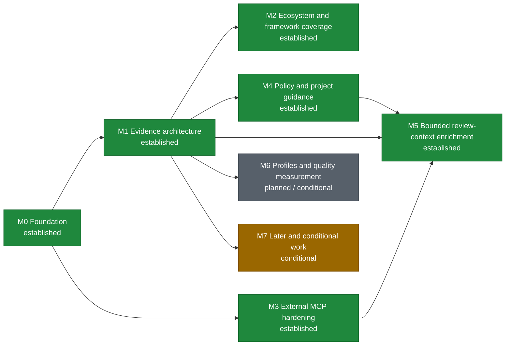

# Roadmap

This roadmap describes ordered outcomes rather than release dates. Architecture direction lives in the [toolkit strategy](docs/engineering/toolkit_strategy.md); implementation-ready inactive work lives in the [backlog](docs/codex/TASKS_BACKLOG.md); current execution lives in [PLANS.md](PLANS.md).

Status vocabulary: **established** means the documented foundation exists, **in progress** is active release work, **next** is the nearest implementation horizon, **planned** has defined dependencies, and **conditional** requires its activation signal.
The diagram uses green for established, blue for in-progress or next work, gray for planned work, and amber for conditional work. A milestone spanning two statuses uses the earliest actionable status color while retaining both statuses in its label.

| Milestone | Status | Intended outcome | Major dependency | Completion signal |
| --- | --- | --- | --- | --- |
| M0 Foundation | Established | Durable planning sources, high-signal repository security checks, and repeatable OCR compatibility policy. | Existing CI and the current recommended/tested OCR baseline. | Strategy, roadmap, and backlog agree; Bandit is a bounded repository gate; every unseen stable OCR release receives checksum-verified machine evidence with adjacent comparison identity; only a wholly safe contiguous patch chain may receive one protected bot-ready update patch, while material or ambiguous changes require human qualification and no path writes directly to `main`. |
| M1 Evidence architecture | Established | One bounded evidence model supplies a compact bootstrap and built-in read-only MCP. | Machine-readable OCR capabilities and current context contracts. | Stable v0.4.0 publishes the model, immutable snapshots, typed deltas, bounded private storage, compact bootstrap, built-in MCP, semantic parity/removal, verified real-OCR use, reporting outcomes, and security hardening; TestPyPI/PyPI artifacts, provenance, hashes, annotated tag, immutable GitHub Release, and supported-Python smoke installs are independently verified. |
| M2 Ecosystem and framework coverage | Established | Supply framework and template evidence selected from demonstrated use without creating framework-specific review engines. | Established evidence, snapshot/delta, scoped-completeness, and built-in MCP contracts. | Selected static plugins and template review rules have deterministic fixtures, bounds, provenance, component ownership, completeness, first-class source/target delta queries, installed-artifact validation, verified use through the existing built-in MCP, and independently read-back stable delivery. |
| M3 External MCP hardening | Established | Qualify and document the safe-use envelope and residual limits of the shipped generic external-MCP composition boundary. | Existing external MCP and built-in composition plus BL-011 real-OCR qualification. | Canonical security and configuration guidance records the direct-composition trust boundaries, tool-name allowlist limits, server-owned object authorization, shared plan/main exposure, response/session persistence, failure degradation, and receipt non-claims observed with checksum-verified OCR and a real synthetic stdio peer. Managed OAuth remains conditional. |
| M4 Policy and project guidance | Established | Supply relevant target-branch decisions and guidance without allowing self-whitelisting. | Evidence scoping and target/source snapshots. | Stable delivery independently proves backward-compatible structured decisions, bounded target-derived guidance, one read-only MCP lifecycle, and closure of the tracked release work. |
| M5 Bounded review-context enrichment | Established | Extend invocation evidence with bounded forge discussions and optional external records through one provider-neutral, capability-constrained context lifecycle, without a second review engine. | Established M1, M3, and M4 boundaries plus the v0.7.0 BL-023 delivery. | The v0.7.0 release acquires bounded snapshots, applies immutable protected-target context/DLP policy, authorizes every object before opaque handle minting, projects fixed `context_list`/`context_get` tools through the existing toolkit MCP, contains OCR persistence, validates publication independently, exposes partial/degraded outcomes, and blocks automatic approval for admitted mutable context. The protected release workflow and independent external readback remain mandatory delivery evidence rather than repository-authored claims. |
| M6 Profiles and quality measurement | Planned / conditional | Audit current OCR telemetry and result-derived review signals; add model-profile aliases only after demonstrated operational need. | Established receipt-v5 result, discussion, coverage, posting, normalized token, and reconciled MCP/evidence-use signals; a demonstrated alias need and owner-approved matrix are required only for profile implementation. | The audit either proves current bounded reporting sufficient or isolates a separately scoped provider-neutral gap; any later model profiles remain independent from explicit coverage and budget controls. |
| M7 Later and conditional work | Conditional | Activate routing, more ecosystems, fuzzing, configuration, forge adapters, or governance work only from demonstrated need. | Milestone-specific activation signals and stable preceding contracts. | Each item meets its own trigger and ships as a coherent validated slice without weakening core invariants. |

## Ordering notes

- OCR compatibility and the established common evidence model converge at compact-bootstrap/evidence-MCP integration.
- M3 is established from BL-011's real-OCR characterization of the current generic composition boundary. Direct composition is an operator-configured privileged facility, not safe author-triggered reference resolution. BL-012 remains conditional and does not block M3 or M5 when reviewed static credentials or a stdio proxy suffice.
- M2 is established through independently verified stable delivery of its framework plugins, template rules, scoped evidence, deltas, and built-in MCP projection. Conditional future ecosystem packs remain in M7 and do not reopen M2.
- M4 is established through independently verified v0.6.0 artifacts and later protected-target identity improvements. M5 consumes but does not reopen its policy boundary.
- M5 is established by the v0.7.0 BL-023 release content. Direct provider-specific MCP enforcement is not a second M5 path: external records stay behind the broker, while generic direct MCP retains the established M3 operator boundary. Its dependency graph is exactly `M1 -> M5`, `M3 -> M5`, and `M4 -> M5`; it is not a gate for M6 or M7. The protected release workflow, immutable receipt, and independent registry/GitHub readback remain mandatory external delivery closure and are not inferred from this status update.
- The M6 measurement-gap audit can begin from receipt v5, privacy-safe normalized token buckets, and reconciled MCP/evidence-action counts delivered in v0.7.1. BL-017 may inventory M5 receipts if they exist, but M5 does not create a second telemetry implementation or exporter. BL-016 remains parked because OCR already exposes direct run-level selection.
- Versioned documentation remains a separate MCP integration: the toolkit supplies package/version evidence but does not store documentation.
- Additional code-hosting adapters remain conditional and GitLab-first M5 does not depend on them.
- Historical roadmap names, release plans, changelog entries, closed issues/PRs, and receipts retain their original identities. BL-022 is historical and is not reused.
- Calendar commitments belong in release or project management systems when work is funded; they are intentionally absent here.
