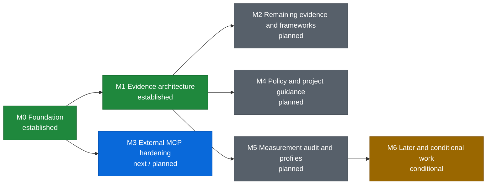

# Roadmap

This roadmap describes ordered outcomes rather than release dates. Architecture direction lives in the [toolkit strategy](docs/engineering/toolkit_strategy.md); implementation-ready inactive work lives in the [backlog](docs/codex/TASKS_BACKLOG.md); current execution lives in [PLANS.md](PLANS.md).

Status vocabulary: **established** means the documented foundation exists, **next** is the nearest implementation horizon, **planned** has defined dependencies, and **conditional** requires its activation signal.
The diagram uses the same statuses as colors: green for established, blue for next, gray for planned, and amber for conditional. A milestone spanning two phases uses the earliest actionable status color while retaining both phases in its label.

| Milestone | Status | Intended outcome | Major dependency | Completion signal |
| --- | --- | --- | --- | --- |
| M0 Foundation | Established | Durable planning sources, high-signal repository security checks, and repeatable OCR compatibility policy. | Existing CI and the current recommended/tested OCR baseline. | Strategy, roadmap, and backlog agree; Bandit is a bounded repository gate; every unseen stable OCR release receives checksum-verified machine evidence with adjacent comparison identity; only a wholly safe contiguous patch chain may receive one protected bot-ready update patch, while material or ambiguous changes require human qualification and no path writes directly to `main`. |
| M1 Evidence architecture | Established | One bounded evidence model supplies a compact bootstrap and built-in read-only MCP. | Machine-readable OCR capabilities and current context contracts. | Stable v0.4.0 publishes the model, immutable snapshots, typed deltas, bounded private storage, compact bootstrap, built-in MCP, semantic parity/removal, verified real-OCR use, reporting outcomes, and security hardening; TestPyPI/PyPI artifacts, provenance, hashes, annotated tag, immutable GitHub Release, and supported-Python smoke installs are independently verified. |
| M2 Ecosystem and framework coverage | Planned | Close demonstrated evidence resolution, precedence, completeness, or component-scope gaps and select framework plugins from actual use. | Established evidence model and snapshot/delta semantics; item-specific gaps only. | Remaining formats and selected framework plugins have deterministic fixtures, bounds, provenance, completeness, and source/target deltas without restating established collectors. |
| M3 External MCP hardening | Next / planned | Threat-model external references and validate provider-specific read-only examples on the established built-in/external MCP composition boundary. | Existing external MCP and built-in composition for current generic operation; BL-011 before reference detection or provider examples. | Threat model precedes reference detection and provider examples; synthetic YouTrack, Confluence, or documentation examples preserve narrow read-only tools, reserved namespaces, and trust separation. Managed OAuth remains conditional on a named provider requirement. |
| M4 Policy and project guidance | Planned | Supply relevant target-branch decisions and guidance without allowing self-whitelisting. | Evidence scoping and target/source snapshots. | Semi-structured decisions remain backward compatible; guidance paths and hints are bounded, target-derived, and non-authoritative. |
| M5 Profiles and quality measurement | Planned | Audit current OCR telemetry and result-derived review signals before adding profiles or any toolkit metrics. | Established result, discussion, coverage, posting, and MCP-use receipts; the owner-approved matrix is required only for profile implementation. | The audit either proves current bounded reporting sufficient or isolates a separately scoped provider-neutral gap; any later profiles are deterministic and documented without sensitive, high-cardinality, or duplicate data. |
| M6 Later and conditional work | Conditional | Activate routing, more ecosystems, fuzzing, configuration, forge adapters, or governance work only from demonstrated need. | Milestone-specific activation signals and stable preceding contracts. | Each item meets its own trigger and ships as a coherent validated slice without weakening core invariants. |

## Ordering notes

- OCR compatibility and the established common evidence model now converge at compact-bootstrap/evidence-MCP integration.
- M3 threat modeling can proceed from the established generic composition boundary; provider examples wait for BL-011, while managed OAuth does not block static-header or stdio operation.
- M2 and M4 can proceed from the stable evidence contracts they consume.
- The M5 measurement-gap audit can begin from current lifecycle and result receipts; BL-016 is required only for later named-profile comparisons.
- Versioned documentation remains a separate MCP integration: the toolkit supplies package/version evidence but does not store documentation.
- Additional code-hosting adapters are not ecosystem collectors. They remain conditional because the near-term product is GitLab-first.
- Calendar commitments belong in release or project management systems when work is funded; they are intentionally absent here.
