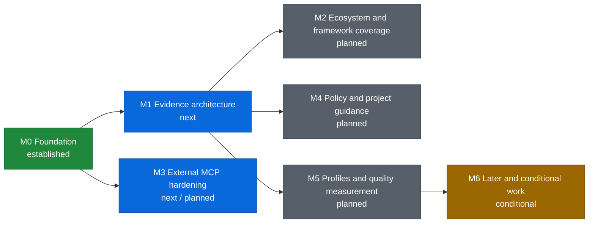

# Roadmap

This roadmap describes ordered outcomes rather than release dates. Architecture direction lives in the [toolkit strategy](docs/engineering/toolkit_strategy.md); implementation-ready inactive work lives in the [backlog](docs/codex/TASKS_BACKLOG.md); current execution lives in [PLANS.md](PLANS.md).

Status vocabulary: **established** means the documented foundation exists, **next** is the nearest implementation horizon, **planned** has defined dependencies, and **conditional** requires its activation signal.
The diagram uses the same statuses as colors: green for established, blue for next, gray for planned, and amber for conditional. A milestone spanning two phases uses the earliest actionable status color while retaining both phases in its label.

| Milestone | Status | Intended outcome | Major dependency | Completion signal |
| --- | --- | --- | --- | --- |
| M0 Foundation | Established | Durable planning sources, high-signal repository security checks, and repeatable OCR compatibility policy. | Existing CI and the current recommended/tested OCR baseline. | Strategy, roadmap, and backlog agree; Bandit is a bounded repository gate; every unseen stable OCR release receives checksum-verified machine evidence; strictly compatible patch releases may receive a protected bot-ready update patch, while material or ambiguous changes require human qualification and no path writes directly to `main`. |
| M1 Evidence architecture | Next | One bounded evidence model supplies a compact bootstrap and built-in read-only MCP. | Machine-readable OCR capabilities and current context contracts. | Implementation is active on issue #30: model, immutable snapshots, typed collectors/deltas, compact bootstrap, built-in read-only MCP, GitLab outcome rendering, history-backed parity and legacy removal, public-invocation synthetic E2E, two OCR review loops, the Codex Security correction loop, final Python 3.12/package gate, and signed local checkpoint are complete; the authorized feature-PR, merge, development-build, and v0.4.0 release gates are in progress. |
| M2 Ecosystem and framework coverage | Planned | Resolve dependency, runtime, container, and framework state for demonstrated repository stacks. | Stable evidence model and snapshot/delta semantics. | Prioritized formats and framework plugins have deterministic fixtures, bounds, provenance, and source/target deltas. |
| M3 External MCP hardening | Next / planned | Secure and document current read-only external MCP first, then compose it with built-in evidence tools. | Existing external MCP for threat modeling and current examples; M1 built-in MCP only for late composition. | Threat model precedes reference detection and provider examples; current generic, proxy, YouTrack, and Confluence patterns are validated; later combined examples enforce reserved namespaces and trust separation. |
| M4 Policy and project guidance | Planned | Supply relevant target-branch decisions and guidance without allowing self-whitelisting. | Evidence scoping and target/source snapshots. | Semi-structured decisions remain backward compatible; guidance paths and hints are bounded, target-derived, and non-authoritative. |
| M5 Profiles and quality measurement | Planned | Offer explicit run-level review profiles and determine whether upstream OCR telemetry/result artifacts already suffice for cost, evidence/MCP behavior, posting, and review-value measurement. | OCR compatibility and the atomic compact-bootstrap/evidence-MCP contract; metrics additionally require stable discussion fingerprints and demonstrated coverage gaps. | Profiles are deterministic and documented; a gap audit either proves upstream coverage sufficient or justifies a bounded provider-neutral toolkit telemetry schema without sensitive, high-cardinality, or duplicate signals. |
| M6 Later and conditional work | Conditional | Activate routing, more ecosystems, fuzzing, configuration, forge adapters, or governance work only from demonstrated need. | Milestone-specific activation signals and stable preceding contracts. | Each item meets its own trigger and ships as a coherent validated slice without weakening core invariants. |

## Ordering notes

- OCR compatibility and the common evidence model proceed in parallel; their contracts converge only at compact-bootstrap/evidence-MCP integration.
- M3 threat modeling and documentation of current external MCP proceed before M1; only built-in/external MCP composition waits for M1.
- M2 and M4 proceed after the evidence contracts they consume stabilize.
- M5 profiles do not wait for every ecosystem, external MCP, or policy item; measurement begins after profile and lifecycle identifiers are stable.
- Versioned documentation remains a separate MCP integration: the toolkit supplies package/version evidence but does not store documentation.
- Additional code-hosting adapters are not ecosystem collectors. They remain conditional because the near-term product is GitLab-first.
- Calendar commitments belong in release or project management systems when work is funded; they are intentionally absent here.
