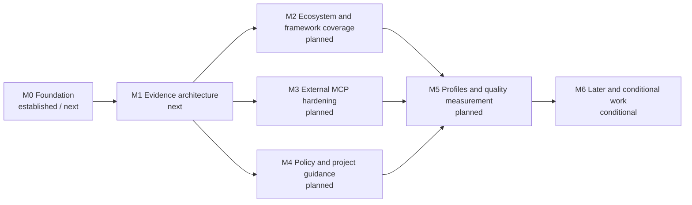

# Roadmap

This roadmap describes ordered outcomes rather than release dates. Architecture direction lives in the [toolkit strategy](docs/engineering/toolkit_strategy.md); implementation-ready inactive work lives in the [backlog](docs/codex/TASKS_BACKLOG.md); current execution lives in [PLANS.md](PLANS.md).

Status vocabulary: **established** means the documented foundation exists, **next** is the nearest implementation horizon, **planned** has defined dependencies, and **conditional** requires its activation signal.

| Milestone | Status | Intended outcome | Major dependency | Completion signal |
| --- | --- | --- | --- | --- |
| M0 Foundation | Established / next | Durable planning sources, high-signal repository security checks, and repeatable OCR compatibility policy. | Existing CI and the current recommended/tested OCR baseline. | Strategy, roadmap, and backlog agree; Bandit is a bounded repository gate; compatibility releases are detected and tested without automatic upgrades. |
| M1 Evidence architecture | Next | One bounded evidence model supplies a compact bootstrap and built-in read-only MCP. | Machine-readable OCR capabilities and current context contracts. | Source/target evidence, provenance, confidence, component scope, bootstrap planning, and MCP projection pass common fixtures. |
| M2 Ecosystem and framework coverage | Planned | Resolve dependency, runtime, container, and framework state for demonstrated repository stacks. | Stable evidence model and snapshot/delta semantics. | Prioritized formats and framework plugins have deterministic fixtures, bounds, provenance, and source/target deltas. |
| M3 External MCP hardening | Planned | Compose narrow read-only external tools without copying untrusted content into the bootstrap. | Built-in MCP composition and external-reference threat model. | Synthetic generic, proxy, YouTrack, and Confluence examples validate allowlists, bounds, audit metadata, and trust separation. |
| M4 Policy and project guidance | Planned | Supply relevant target-branch decisions and guidance without allowing self-whitelisting. | Evidence scoping and target/source snapshots. | Semi-structured decisions remain backward compatible; guidance paths and hints are bounded, target-derived, and non-authoritative. |
| M5 Profiles and quality measurement | Planned | Offer explicit run-level review profiles and measure their cost and review value. | Reliable evidence, MCP, and policy behavior. | Profiles are deterministic and documented; latency, tokens, evidence use, and review outcomes support comparison. |
| M6 Later and conditional work | Conditional | Activate routing, more ecosystems, fuzzing, configuration, forge adapters, or governance work only from demonstrated need. | Milestone-specific activation signals and stable preceding contracts. | Each item meets its own trigger and ships as a coherent validated slice without weakening core invariants. |

## Ordering notes

- M2, M3, and M4 may proceed in parallel after the M1 evidence contracts stabilize.
- Versioned documentation remains a separate MCP integration: the toolkit supplies package/version evidence but does not store documentation.
- Additional code-hosting adapters are not ecosystem collectors. They remain conditional because the near-term product is GitLab-first.
- Calendar commitments belong in release or project management systems when work is funded; they are intentionally absent here.
