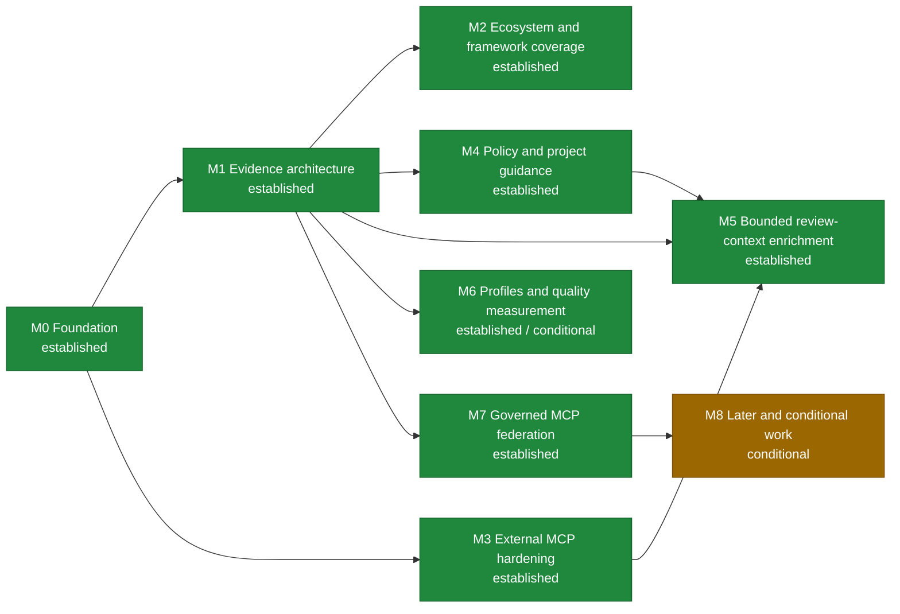

# Roadmap

This roadmap describes ordered outcomes rather than release dates. Architecture direction lives in the [toolkit strategy](docs/engineering/toolkit_strategy.md); implementation-ready inactive work lives in the [backlog](docs/codex/TASKS_BACKLOG.md); current execution lives in [PLANS.md](PLANS.md).

Status vocabulary: **established** means the documented foundation exists,
**in progress** is active implementation, **next** is the nearest implementation
horizon, **planned** has defined dependencies, and **conditional** requires its
activation signal.
The diagram uses green for established, blue for in-progress or next work, gray
for planned work, and amber for conditional work.
A milestone spanning two statuses uses the earliest actionable status color while
retaining both statuses in its label.

| Milestone | Status | Intended outcome | Major dependency | Completion signal |
| --- | --- | --- | --- | --- |
| M0 Foundation | Established | Durable planning sources, high-signal repository security checks, and repeatable OCR compatibility policy. | Existing CI and the current recommended/tested OCR baseline. | Strategy, roadmap, and backlog agree; Bandit is a bounded repository gate; every unseen stable OCR release receives checksum-verified machine evidence with adjacent comparison identity; only a wholly safe contiguous patch chain may receive one protected bot-ready update patch, while material or ambiguous changes require human qualification and no path writes directly to `main`. |
| M1 Evidence architecture | Established | One bounded evidence model supplies a compact bootstrap and built-in read-only MCP. | Machine-readable OCR capabilities and current context contracts. | Stable v0.4.0 publishes the model, immutable snapshots, typed deltas, bounded private storage, compact bootstrap, built-in MCP, semantic parity/removal, verified real-OCR use, reporting outcomes, and security hardening; TestPyPI/PyPI artifacts, provenance, hashes, annotated tag, immutable GitHub Release, and supported-Python smoke installs are independently verified. |
| M2 Ecosystem and framework coverage | Established | Supply framework and template evidence selected from demonstrated use without creating framework-specific review engines. | Established evidence, snapshot/delta, scoped-completeness, and built-in MCP contracts. | Selected static plugins and template review rules have deterministic fixtures, bounds, provenance, component ownership, completeness, first-class source/target delta queries, installed-artifact validation, verified use through the existing built-in MCP, and independently read-back stable delivery. |
| M3 External MCP hardening | Established / superseded | Preserve the historical qualification of OCR's former direct-composition boundary. | BL-011 real-OCR qualification. | Historical evidence remains readable, while M7 removes direct passthrough and executable adapters from the current product contract. |
| M4 Policy and project guidance | Established | Supply relevant target-branch decisions and guidance without allowing self-whitelisting. | Evidence scoping and target/source snapshots. | Stable delivery independently proves backward-compatible structured decisions, bounded target-derived guidance, one read-only MCP lifecycle, and closure of the tracked release work. |
| M5 Bounded review-context enrichment | Established | Extend invocation evidence with bounded forge discussions, verified remediation history, protected same-revision CI outcomes, and optional external records through one provider-neutral, capability-constrained context lifecycle, without a second review engine. | Established M1, M3, and M4 boundaries plus the v0.7.0 BL-023 delivery. | v0.7.0 establishes bounded discussion/reference acquisition. The v0.8.0 release tree adds policy-v2 remediation selection, context-store v2 and fixed MCP projection, live bot-root/mention identity, DLP isolation, comment-only remediation, and provider-neutral reuse boundaries. v0.8.7 adds policy-v3 exact-head CI outcomes as scoped review evidence without suppression or approval authority. Toolkit 0.9.0 adds receipt-v8 source/target/protection binding and a separate comment-only path for explicitly allowed unprotected targets; that path rejects protected policy, enrichment, adapters, external MCP, accepted decisions, and structured target guidance rather than claiming protected-policy equivalence. The owner waived the separate enriched OCR+LLM qualification, so no receipt proves model-time `context_list`/`context_get`, still-present/evidence-resolved scenarios, or receipt-level raw-data leakage inspection. Protected release publication and independent external readback remain mandatory delivery evidence but do not replace that absent qualification. |
| M6 Profiles and quality measurement | Established / conditional | Keep the completed review-signal ownership audit current; add model-profile aliases only after demonstrated operational need. | The BL-017 audit establishes OCR/provider telemetry and toolkit lifecycle-signal ownership; a demonstrated alias need and owner-approved matrix are required only for profile implementation. | The audit concludes `no-new-layer`; any later model profiles remain conditional and independent from explicit coverage and budget controls. |
| M7 Governed MCP federation | Established | Replace direct passthrough and executable context adapters with one bounded registry-v2 federation gateway while preserving mandatory internal evidence and OCR as the sole model loop. | Established evidence/context contracts plus issues #188-#193 and #203. | Registry v2, SDK-v2-primary independent protocol negotiation, legacy policy parse-only migration, receipt v9 accounting, stage-aware DLP, strict DLP mode, local/GitLab parity and OCR 1.12.7 qualification pass. |
| M8 Later and conditional work | Conditional | Activate routing, more ecosystems, fuzzing, configuration, forge providers, or further governance work only from demonstrated need. | Milestone-specific activation signals and stable preceding contracts, including M7 where federation is involved. | Each item meets its own trigger and ships as a coherent validated slice without weakening core invariants. |

## Ordering notes

- The active 0.11.0 draft implements M7 governed federation, policy-v4 migration,
  receipt-v9 accounting, stage-aware DLP and the explicit default-on DLP control.
  It does not reopen established milestones or activate conditional second-forge,
  model-profile, routing or evidence-pack work. Draft readiness, configured-model
  qualification and stable delivery remain separate states in `PLANS.md`.

- OCR compatibility and the established common evidence model converge at compact-bootstrap/evidence-MCP integration.
- M3 preserves BL-011's historical characterization. M7 supersedes that runtime path with governed federation; the old direct composition and adapter execution contracts are not current fallback paths.
- M2 is established through independently verified stable delivery of its framework plugins, template rules, scoped evidence, deltas, and built-in MCP projection. Conditional future ecosystem packs remain in M7 and do not reopen M2.
- M4 is established through independently verified v0.6.0 artifacts and later protected-target identity improvements. M5 consumes but does not reopen its policy boundary.
- M5's foundation remains established for GitLab discussions, remediation, CI outcomes and local handles. M7 policy v4 removes new references; v1-v3 references remain parse-only migration input and never execute.
- The completed M6 BL-017 audit maps the versioned toolkit receipt, privacy-safe normalized token buckets, reconciled MCP/evidence/federation counts, and OCR grouping/round telemetry to their existing owners and concludes `no-new-layer`. Receipt v9 adds federation and stage-aware DLP accounting without creating telemetry.
- Versioned documentation remains a separate MCP integration: the toolkit supplies package/version evidence but does not store documentation.
- Additional code-hosting adapters remain conditional and GitLab-first M5 does not depend on them.
- Historical roadmap names, release plans, changelog entries, closed issues/PRs, and receipts retain their original identities. BL-022 is historical and is not reused.
- Calendar commitments belong in release or project management systems when work is funded; they are intentionally absent here.
