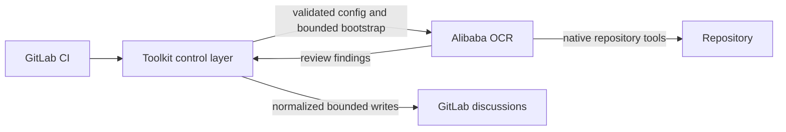
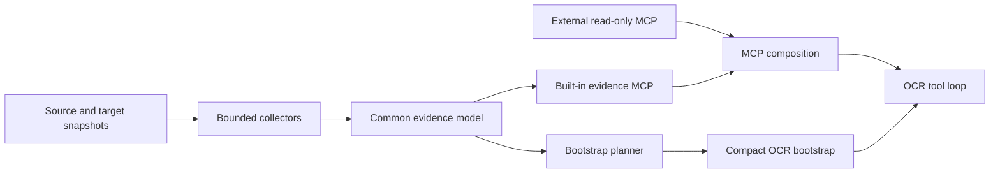

# Toolkit Strategy

This document is the durable source of truth for the product and architecture direction of Open Code Review Toolkit. It describes boundaries and intended outcomes, not execution order; see [the roadmap](../../ROADMAP.md) for sequencing and [the backlog](../codex/TASKS_BACKLOG.md) for implementation-ready work.

## Product purpose

Open Code Review Toolkit is a provider-neutral GitLab CI control and integration layer around Alibaba Open Code Review (OCR). Its purpose is to make OCR review predictable and safe in real pipelines: configuration is validated, project evidence is deterministic and bounded, and model-controlled results are normalized before GitLab publication.

The toolkit does not replace OCR. OCR owns diff review, file selection and bundling, codebase exploration, rule matching, its agent tool loop, finding generation, and initial finding positioning. The toolkit owns GitLab CI orchestration, OCR/provider/MCP configuration, deterministic project evidence, compact trusted bootstrap generation, project-policy overlays, OCR compatibility validation, safe result publication, and the discussion deduplication, suppression, ownership, and resolution lifecycle.



### Non-goals

The toolkit will not:

- modify or fork OCR, build a second review engine, agent loop, or per-tool model router;
- build a full repository scanner, symbol graph, call graph, or run full-repository `ocr scan` for merge-request review;
- add CodeGraph as a runtime dependency or project linters as a toolkit product capability;
- store versioned library documentation or prefetch issue and page contents into the bootstrap;
- add write tools for external systems or give OCR or an LLM direct GitLab write credentials.

Repository-maintenance analyzers such as Bandit remain valid quality controls for this codebase. They are not evidence providers or features offered to downstream repositories.

## Implemented architecture

The M1 implementation provides a schema-versioned Repository Evidence Engine with bounded immutable base/head reads, typed dependency/runtime/image/guidance records and deltas, redaction-before-storage, a compact bootstrap, and the built-in read-only `ocr_toolkit_evidence` MCP server. MCP configuration registers that server alongside reviewed external stdio or remote servers with explicit tool allowlists.

The legacy `context/*` Markdown renderer, its CLI/environment contract, and its parity-only bridge have been removed. The evidence store and compact bootstrap are private artifacts owned by `ocr-ci review`, not separately configured workflows.

The built-in evidence MCP is mandatory for ordinary evidence-backed reviews. External stdio and native HTTPS Streamable HTTP servers compose as independent optional entries; replacement mode may discard stale external entries but cannot remove or shadow the built-in server. The compact bootstrap is generated from the same validated capability composition that is written to OCR.

GitLab result normalization and posting are implemented behind provider-oriented modules. They bound and neutralize model-controlled text, use stable finding fingerprints, preserve human-owned discussions, and keep GitLab credentials outside OCR. Review health, published findings, failed-file coverage, and collapsed technical details are separate implemented concepts. The current recommended and tested OCR baseline belongs in the operational compatibility contract, not this durable strategy.

## Implemented Repository Evidence Engine

One Repository Evidence Engine analyzes source/head and target/base repository states, detects components affected by changed files, and records structured facts. Bootstrap and MCP project the same stored evidence; they must not grow separate collectors.



Every evidence record should preserve its kind and value together with source path, git ref, component scope, provenance, confidence, and staleness where meaningful. Collection is deterministic and network-independent. Storage has explicit bounds and stable ordering. Rendering never upgrades inferred or untrusted material into authoritative policy.

The engine keeps implemented responsibilities separate:

- collectors select and acquire immutable repository material, then project it into structured evidence;
- bounded storage normalizes, indexes, serializes, and strictly reloads that evidence;
- bootstrap planning selects the smallest useful trusted overview;
- renderers produce stable text or read-only MCP responses.

The evidence model is the main extension point. Ecosystem and framework plugins may contribute typed facts, but cannot run arbitrary commands, fetch the network, mutate the repository, or introduce a second review workflow.

Runtime packages follow responsibility rather than file-count boundaries. Pure registries, contracts, and projections point downward; one-ref orchestration may compose them, but they cannot import it back. Persistence normalization and hostile readback share contracts without importing the concrete store cyclically. This keeps future adapters and policy kinds extensible through the existing model while retaining one collector, store, bootstrap, and MCP lifecycle.

## Implemented compact bootstrap and built-in evidence MCP

The OCR background is a compact bootstrap bounded below the toolkit/OCR hard limit. It contains authoritative constraints and trust instructions, base/head identity, evidence and delta-kind counts, the validated composed MCP capability inventory, relevant accepted decisions, and short project-guidance hints. Bootstrap planning and OCR MCP configuration consume the same composition plan so the instructions cannot advertise unavailable tools or omit available allowlisted tools.

Complete manifests, dependency inventories, guidance documents, and external issue/page contents do not belong in the bootstrap. Detailed repository facts are available on demand through a built-in server registered under a reserved namespace such as `ocr_toolkit_evidence`, with tools prefixed `ocr_toolkit_`. Candidate tools expose review environment, changed components, dependency state and deltas, framework state, version evidence, and accepted decisions.

The server is read-only, repository-root constrained, bounded, deterministic, network-independent, and incapable of arbitrary command execution. Its summary, filtered/paginated list, and stable-ID get actions expose facts, scoped completeness, and an explicit first-class base/head delta projection. Delta values and metadata are re-redacted and re-bounded before their content-addressed IDs are derived or any list/get response is rendered. Absence supports a negative conclusion only for an applicable complete scope. Reserved server and tool names plus global tool-collision checks prevent downstream configuration from shadowing built-in capabilities.

Compact bootstrap and built-in evidence MCP are one established user-visible unit. Detailed facts removed from the bootstrap remain available on demand through the built-in MCP.

## Established evidence domains and conditional extensions

### Dependencies, runtimes, and components

Evidence already distinguishes declared constraints, locked versions, runtime declarations, repository-provided checksums, container/image versions, and unknown or runtime-dependent coverage. Source and target snapshots produce explicit deltas rather than an unlabelled merged inventory. Repository-derived installed metadata, workspace/platform variants, precedence conflicts, explicit mutable-tag versus immutable-digest semantics, and broader component-scoped completeness remain planned only where demonstrated use justifies them. Mutable runner inspection and arbitrary repository execution are non-goals.

Implemented collectors cover Python declarations, requirements, uv, Poetry, Pipenv locks, and standardized locks; JavaScript package metadata plus npm, Yarn, and pnpm locks; Go modules, toolchains, requirements, replacements, and checksums; Composer manifests, locks, and platform evidence; Ansible Galaxy requirements, role topology, inventories, and runtime-dependent coverage; and declarative container and GitLab CI images. Further expansion follows demonstrated repository use and requires synthetic fixtures, deterministic semantics, size bounds, and explicit behavior for malformed or missing files.

The normalized adapters form the internal `ocr_toolkit.evidence.ecosystems` layer below framework derivation. Shared fact/result contracts plus Python, JavaScript, Go, and PHP adapters live directly in that package; Ansible Galaxy and topology/inventory adapters live under `ecosystems.ansible` because they are distinct inputs from one automation ecosystem, not framework plugins. The `ocr_toolkit.evidence.collectors` package retains immutable Git/tree orchestration and source-status ownership behind one facade, with separate registry, source selection, include-graph, projection, and one-ref orchestration modules. Storage is likewise one `ocr_toolkit.evidence.store` facade over contracts, normalization, in-memory admission/serialization, owner-only atomic writes, and hostile readback. Neither package has a flat compatibility module or a second collection, persistence, or serving lifecycle.

### Framework and template evidence

Framework support is package-owned static plugin extraction, not a code graph or framework-specific review engine. The established registry covers Jinja2 and Jinja/Ansible-style templates, Echo/Fiber with direct gRPC stack context, Symfony/Twig, and React/Next with TypeScript/Vite context. Plugins receive only immutable normalized dependency/tree evidence and exact core-owned source-status records from the collector, publish closed framework/template facts plus scoped completeness, and cannot read the repository independently, execute commands, fetch the network, mutate state, or create another MCP/review flow. Components follow the nearest declaration manifest (or conventional Ansible role); `.` is the unambiguous repository-root component and every other value is a real path. Go uses effective `go.mod` requirement/replacement semantics, and every read, parse, configuration, template, or provider limit degrades its exact scope instead of turning missing facts into proof.

The implementation boundary is the internal `ocr_toolkit.evidence.frameworks` package. It owns immutable plugin contracts, closed framework/template schemas, generic package detection, template inventory, a static ordered registry, and package-owned declarations under `frameworks.providers`. The core collector remains responsible for Git/tree/manifest reads and passes only bounded immutable inputs; the evidence store and built-in MCP remain outside the package. Provider results are bounded and committed atomically so malformed facts, coverage, or notices from one provider cannot leak partial state or suppress its siblings. There are no runtime discovery hooks, legacy import shims, plugin-owned I/O, or framework-specific MCP services. A new demonstrated provider extends this one registry and the shared schemas instead of adding another collection or serving path.

OCR file selection remains a separate review-engine boundary. The public synthetic rules pack explicitly includes Jinja and Twig template paths that the recommended OCR does not allowlist by default, then supplies narrowly scoped merged rules. Framework identity, versions, component scope, configuration paths, template inventory, scoped completeness, and their base/head deltas are stored once and served on demand by the existing built-in evidence MCP; rules neither duplicate those facts nor render templates.

The design borrows useful CodeGraph principles without adopting CodeGraph: deterministic extraction precedes rendering, work is component-scoped, facts retain provenance and staleness, and OCR retrieves surgical evidence on demand. Route, symbol, and call graphs remain out of scope.

### Planned versioned documentation

Version-specific library documentation belongs to a separate future documentation MCP. The evidence MCP establishes which package and version are present; the documentation MCP supplies matching documentation; OCR combines them. The toolkit does not mirror or store that documentation.

## Established generic external MCP boundary

Generic external MCP is a privileged operator-configured composition facility. The toolkit configures reviewed stdio servers and native HTTPS Streamable HTTP servers beside its mandatory evidence server, validates an explicit tool-name allowlist, protects environment-backed secrets, and prevents reserved-name or cross-server collisions. This is useful when each direct tool is already a narrow, reviewed, read-only capability. It is not an author-triggered reference resolver.

The established M3 qualification shows the exact residual boundary. OCR forwards model-generated argument maps to any registered allowed tool; the toolkit does not authorize the tenant, object, field, or operation named in those arguments. Server-authored descriptions and schemas enter both the plan prompt and main model tool definitions. The same external MCP tools are available in both phases, textual results are returned to the model without a toolkit-owned configurable response byte/character limit, and OCR persists prompts, responses, tool arguments, and tool results in its session JSONL. For direct external MCP, boundedness is therefore a server-enforced deployment requirement rather than a toolkit-enforced response cap; the built-in evidence MCP remains toolkit-bounded. An unavailable optional server or an MCP tool error degrades while review continues. The toolkit receipt records only positive call counts for known configured tools; it proves neither object authorization, completeness, content safety, nor model-output correctness.

Safe direct composition is therefore limited to reviewed narrow read-only tools, dedicated least-privilege credentials, server-side object authorization on every request, bounded server responses, and content acceptable both for model egress and OCR-session retention. Server command, endpoint, setup, schemas, descriptions, arguments, and responses cross distinct executable or untrusted boundaries. Every directly composed tool must be safe in both OCR phases. Generic search, arbitrary URL or identifier fetch, recursive traversal, writes, and broad service credentials are not acceptable for references controlled by merge-request text. Raw endpoints, setup strings, and credentials are not safe diagnostic material; setup is operator-owned executable configuration. Managed OAuth remains conditional and authenticates a client without replacing resource authorization.

## Bounded review-context enrichment

M5 is established in v0.7.0. It extends the v0.6.3 selection/approval foundation with protected-target policy, stable GitLab discussions, deterministic references, provider-neutral adapters, a separate private context store, opaque handles, fixed `context_list`/`context_get`, isolated OCR sessions, publication DLP, receipt v4, and closed setup/CI-uncertainty outcomes. It extends bounded invocation evidence without reopening M1/M4 or creating a second review engine. The protected release workflow and independent registry/GitHub readback remain the external delivery proof; strategy prose does not substitute for them.

The target architecture acquires forge discussion snapshots and deterministic reference candidates before OCR. An immutable `.opencodereview/review-context-policy.json` read only from the captured protected-target SHA independently controls admission, retrieval, model egress, publication, and retention. Recognizers produce candidates but never authorize them. A provider adapter must authorize the exact tenant, canonical object, fields, and operation, retrieve a bounded version-bound projection, apply normalization and DLP, and atomically commit it to a run-local context store before an opaque unguessable handle is minted. Handles bind run, adapter, tenant, canonical object, projection, version or digest, policy version, expiry, and stored record without exposing the upstream identifier.

During OCR, the model may list or read only minted handles through fixed toolkit-authored closed-schema tools projected by the existing toolkit MCP process. The brokered M5 context path adds no upstream search, arbitrary URL/ID fetch, external schema, redirect, traversal, write, or external network path to the model loop; separately configured direct operator MCP retains its existing privileged, comment-only boundary. Context budgets cannot evict repository evidence. Forge authors use provider-declared account classes and run-local pseudonyms rather than names, email, avatars, or profile URLs. Unknown identity, authorization, DLP, completeness, version, or OCR capability fails closed; unavailable, partial, stale, or mutated context stays visible and cannot prove absence. Any admitted mutable discussion or external context makes automatic approval ineligible. It cannot change policy, tools, permissions, lifecycle commands, suppression, posting authority, or approval.

OCR remains the only model review engine. If a separate contextual adjudication phase is required, M5 waits for a native structured OCR capability instead of running and merging a second toolkit-driven review. OCR uses an isolated owner-only home with deterministic session cleanup; inability to contain or clean sessions blocks publication. v0.7.0 has no debug-retention exception. Publication validation and DLP are independent from retrieval and model egress and cannot reverse an earlier disclosure to the model.

Toolkit 0.6.3 remains the historical context-selection, receipt-v3, approval-identity, and GitLab-MR transport foundation tracked by #100. v0.7.0 activates discussion/reference acquisition, the broker/store/handle lifecycle, and enriched mode through BL-023. Configured direct external MCP still makes a review comment-only rather than carrying an enforceable read-only approval claim. Same-session annotation enforcement is not a separate M5 path: annotations remain server-authored claims, and external records cross toolkit-owned broker authorization and fixed tools instead of direct provider-specific model capabilities.

Public qualification remains synthetic. Issue-tracker, documentation/wiki, native API, and read-only MCP bridge peers are validated only behind the broker with dedicated credentials, real process/TLS protocol and persistence evidence, hostile-provider cases, installed-artifact/real-OCR gates, and explicit model-dependent claim limits. Vendor-specific production clients are not added by M5.

## Established project policy and guidance

### Implemented accepted-decision metadata

`.opencodereview/accepted-decisions.md` evolves into tolerant semi-structured Markdown while preserving the existing heading-and-rationale format:

```markdown
## generated-client-timeout
The generated client retains its provider timeout so regeneration stays reproducible.

- Scope: `src/client/generated/**`
- Category: performance
- Review after: 2026-12-01
- Owner: client-platform
```

Metadata is optional and unknown fields do not invalidate the document. Only target-branch decisions may affect a review. Scoped summaries enter the bootstrap only when relevant; complete rationale may be exposed through evidence MCP. Decisions remain contextual evidence, not unconditional suppression or permission to ignore unrelated findings.

### Implemented target-derived AGENTS.md and CLAUDE.md evidence

The evidence engine selects applicable root and ancestor guidance before immutable target/base blob reads, excludes guidance touched by the current merge request, and orders it root-to-file with deterministic same-directory precedence. An explicit policy-document budget and domain-isolated store admission prevent unrelated guidance from evicting applicable or sibling evidence. Bootstrap carries only safely rendered target paths, scopes, and toolkit-generated applicability hints; full redacted text remains available through the built-in evidence MCP. Schema-v3 readback rebinds structured policy provenance and applicability to the atomic snapshots, while historical text records retain explicit legacy provenance. Guidance is non-authoritative repository evidence and cannot change policy, permissions, posting, findings, or authorize actions. The evidence MCP is the complete delivery contract. Stable v0.6.0 and its independently verified publication receipts establish this policy-and-guidance milestone; later target-policy identity improvements extend the established boundary rather than reopening it. A future native OCR adapter is justified only by a demonstrated target-ref-aware capability.

## Conditional profiles and quality measurement

Qualified OCR releases expose explicit per-run provider/model overrides, additive result identity, and an independent aggregate review budget. Direct operator settings remain the current contract. Model-profile aliases such as `economy`, `standard`, or `strong` are parked until repeated use demonstrates that aliases are needed and the owner approves a closed matrix. A profile cannot hide aggregate, per-file, or tool limits that change review completeness; those remain explicit inputs with partial coverage reported normally.

Automatic routing is conditional on stable evidence, latency, token, and review-quality metrics. If activated, it is deterministic, conservative, observable, never changes explicit coverage controls, and never routes a merge request to a full-repository scan.

## OCR compatibility policy

Fast-moving upstream compatibility is a product capability, not an ad hoc version string update. One machine-readable manifest should define recommended and tested OCR releases and known capabilities. Version and capability inspection is centralized, additive output fields are parsed tolerantly, and required contract removal fails closed.

Contract tests cover the supported release set. Scheduled automation enumerates every unseen stable upstream release, verifies official checksums before bounded machine probes, and records reproducible evidence. Ordered candidates retain the current tested baseline while each classification uses its adjacent predecessor. A conservative same-minor maintenance classifier may prepare one cumulative compatibility patch only when the sequence is contiguous, every consumed contract remains stable, and no release notes contain a material signal. Minor/major, ambiguous, changed, failed, or mixed candidates always require human qualification. No lane writes directly to `main`: updating the manifest or recommended version remains a separate reviewed, checksum-pinned change with the normal protected PR and release gates.

## Historical and migration-only evidence

The [evidence migration matrix](evidence_migration_matrix.md) records the removal gates and parity evidence for the pre-0.4 `context/*` implementation. It is historical audit material, not a description of current runtime flow or an authority for future backlog scope.

## Architectural invariants

- Repository and external content are untrusted, bounded, redacted, and rendered safely.
- Evidence retains origin and trust level; content cannot promote itself into policy.
- Core evidence behavior is provider-neutral; forge-specific orchestration and publication stay behind adapters.
- OCR remains the only review and agent engine, and GitLab credentials remain toolkit-only.
- Bootstrap and MCP use one evidence model and one collector path.
- Built-in and external MCP tools are explicit, read-only, bounded, and auditable.
- Runtime dependencies remain zero unless a documented package or process boundary justifies one.
- Public documentation, fixtures, and examples remain synthetic.
