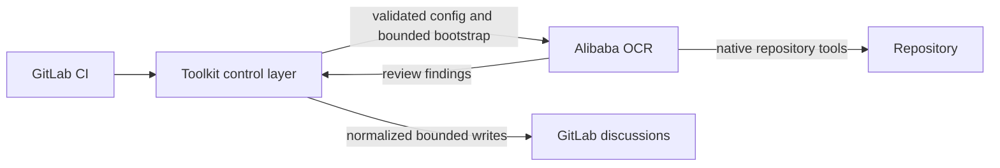
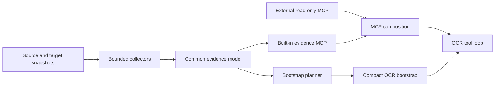

# Toolkit Strategy

This document is the durable source of truth for the product and architecture direction of Open Code Review Toolkit. It describes boundaries and intended outcomes, not execution order; see [the roadmap](../../ROADMAP.md) for sequencing and [the backlog](../codex/TASKS_BACKLOG.md) for implementation-ready work.

## Product purpose

Open Code Review Toolkit is a provider-neutral GitLab CI control and integration layer around Alibaba Open Code Review (OCR). Its purpose is to make OCR review predictable and safe in real pipelines: configuration is validated, project evidence is deterministic and bounded, and model-controlled results are normalized before GitLab publication.

The toolkit does not replace OCR. OCR owns diff review, file selection and bundling, codebase exploration, rule matching, its agent tool loop, finding generation, and initial finding positioning. The toolkit owns GitLab CI orchestration, OCR/provider/MCP configuration, deterministic project evidence, compact trusted bootstrap generation, project-policy overlays, OCR compatibility validation, safe result publication, and the discussion deduplication, suppression, ownership, and resolution lifecycle.



### Non-goals

The toolkit will not:

- modify or fork OCR, build a second review engine, agent loop, or per-tool model router;
- build a full repository scanner, symbol graph, call graph, or run full-repository `ocr scan` for merge-request review;
- add CodeGraph as a runtime dependency or project linters as a toolkit product capability;
- store versioned library documentation or prefetch issue and page contents into the bootstrap;
- add write tools for external systems or give OCR or an LLM direct GitLab write credentials.

Repository-maintenance analyzers such as Bandit remain valid quality controls for this codebase. They are not evidence providers or features offered to downstream repositories.

## Current state

The current context implementation is a bounded Markdown generator rather than an evidence engine. It already detects changed-file categories, reads selected manifests, extracts Python, JavaScript, Go, PHP, Ansible, container, and GitLab CI facts, and includes target-branch-safe project guidance and accepted decisions. It redacts sensitive values, limits reads and output, and degrades explicitly when evidence is incomplete.

These capabilities are partial foundations: most facts are rendered directly, dependency versions primarily reflect declarations rather than resolved source/target state, and `context/render.py` still combines collection, prioritization, and presentation. MCP configuration currently validates and installs external stdio servers with explicit tool allowlists; the toolkit does not yet provide a built-in evidence MCP.

GitLab result normalization and posting are implemented behind provider-oriented modules. They bound and neutralize model-controlled text, use stable finding fingerprints, preserve human-owned discussions, and keep GitLab credentials outside OCR. The current recommended and tested OCR baseline belongs in the operational compatibility contract, not this durable strategy.

## Repository Evidence Engine

The target architecture is one Repository Evidence Engine that analyzes source/head and target/base repository states, detects components affected by changed files, and records structured facts. Bootstrap and MCP must project the same stored evidence; they must not grow separate collectors.



Every evidence record should preserve its kind and value together with source path, git ref, component scope, provenance, confidence, and staleness where meaningful. Collection is deterministic and network-independent. Storage has explicit bounds and stable ordering. Rendering never upgrades inferred or untrusted material into authoritative policy.

The engine separates four responsibilities now concentrated in rendering code:

1. collectors parse repository material into structured evidence;
2. bounded storage normalizes and indexes that evidence;
3. bootstrap planning selects the smallest useful trusted overview;
4. renderers produce stable text or read-only MCP responses.

The evidence model is the main extension point. Ecosystem and framework plugins may contribute typed facts, but cannot run arbitrary commands, fetch the network, mutate the repository, or introduce a second review workflow.

## Compact bootstrap and built-in evidence MCP

The OCR background should become a compact bootstrap, normally around 1,500-2,500 characters and always below the existing toolkit/OCR hard limit. It contains only authoritative constraints and trust instructions, base/head identity, detected ecosystems and frameworks, material runtime or dependency changes, normalized external reference identifiers, available MCP capabilities, relevant accepted decisions, and short project-guidance hints.

Complete manifests, dependency inventories, guidance documents, and external issue/page contents do not belong in the bootstrap. Detailed repository facts are available on demand through a built-in server registered under a reserved namespace such as `ocr_toolkit_evidence`, with tools prefixed `ocr_toolkit_`. Candidate tools expose review environment, changed components, dependency state and deltas, framework state, version evidence, and accepted decisions.

The server is read-only, repository-root constrained, bounded, deterministic, network-independent, and incapable of arbitrary command execution. External MCP configuration is composed with this server rather than replacing it. Reserved names prevent downstream configuration from shadowing built-in tools.

Compact bootstrap and built-in evidence MCP form one user-visible rollout unit. `legacy_background` remains the compatibility and rollback projection until the built-in server is registered and its OCR capability contract passes; `compact_bootstrap` must not become the default in an intermediate release that removes detailed facts without providing on-demand evidence.

## Evidence domains

### Dependencies, runtimes, and components

Evidence distinguishes declared constraints, locked versions, installed versions, runtime-detected versions, container/image pins, and inferred or unknown values. Source and target snapshots produce explicit deltas rather than an unlabelled merged inventory.

Expansion follows demonstrated repository use. Initial work strengthens formats already represented in the current collectors: Python manifests, requirements and lockfiles; JavaScript package metadata and npm, pnpm, Yarn, or Bun locks; Go modules and toolchains; Composer manifests, locks, platform configuration and installed metadata; Ansible requirements, collections and execution environments; containers and GitLab CI images. Every format requires synthetic fixtures, deterministic semantics, size bounds, and explicit behavior for malformed or missing files.

### Framework evidence

Framework support is plugin-oriented structured extraction, not a code graph or framework-specific review engine. Useful facts are framework identity, verified version, component scope, important configuration paths, and material source/target changes. Initial plugins are selected from demonstrated repositories and testable fixtures; candidates include common Python, Go, PHP, JavaScript, test, and Ansible frameworks.

The design borrows useful CodeGraph principles without adopting CodeGraph: deterministic extraction precedes rendering, work is component-scoped, facts retain provenance and staleness, and OCR retrieves surgical evidence on demand. Route, symbol, and call graphs remain out of scope.

### Versioned documentation

Version-specific library documentation belongs to a separate future documentation MCP. The evidence MCP establishes which package and version are present; the documentation MCP supplies matching documentation; OCR combines them. The toolkit does not mirror or store that documentation.

## External MCP and references

YouTrack, Confluence, documentation, and other external sources connect directly to OCR through narrowly scoped read-only MCP tools. The toolkit already configures external stdio servers with explicit tool allowlists and protected secret injection. While OCR lacks stable native remote MCP support, the toolkit may support the existing HTTP-to-stdio proxy pattern. Automatic candidate-reference detection in merge-request metadata is planned, not implemented; when introduced, it adds only normalized identifiers and usage instructions to the bootstrap and does not prefetch or duplicate external content.

All merge-request metadata and external MCP responses are untrusted evidence. A dedicated threat model must precede automatic reference detection and public provider-specific YouTrack or Confluence examples; it does not depend on the future built-in evidence MCP. Safe integration requires configured project-key patterns, allowed hosts or spaces, canonical parsing, bounded reference counts and link traversal, narrow tools instead of generic URL fetch, explicit prompt-injection guidance, and audit metadata for detected and retrieved references. External content cannot change review policy, suppress findings, authorize actions, modify tool permissions, or grant write access.

Public examples use only synthetic services. Current-operation examples cover generic stdio MCP, HTTP-to-stdio proxying, read-only YouTrack, and read-only Confluence after the external-reference threat model is complete. Composition with the built-in evidence MCP is a later integration stage with reserved namespace and collision contracts. External-system writes remain outside the generic toolkit scope.

## Project policy and guidance

### Accepted decisions

`.opencodereview/accepted-decisions.md` evolves into tolerant semi-structured Markdown while preserving the existing heading-and-rationale format:

```markdown
## generated-client-timeout
The generated client retains its provider timeout so regeneration stays reproducible.

- Scope: `src/client/generated/**`
- Category: performance
- Review after: 2026-12-01
- Owner: client-platform
```

Metadata is optional and unknown fields do not invalidate the document. Only target-branch decisions may affect a review. Scoped summaries enter the bootstrap only when relevant; complete rationale may be exposed through evidence MCP. Decisions remain contextual evidence, not unconditional suppression or permission to ignore unrelated findings.

### AGENTS.md and CLAUDE.md

The existing bounded, fail-closed guidance handling remains until upstream OCR documents and tests an automatic project-guidance contract. The intended simplification discovers applicable files, uses target-branch versions, excludes guidance modified by the current merge request, and passes paths plus short hints. Guidance is non-authoritative repository evidence; OCR may read the full target-branch files with its native repository tools when needed.

## Review profiles and quality measurement

OCR uses one configured model per review run. A lightweight explicit profile abstraction may select that run-level model and existing OCR limits: `economy`, `standard`, or `strong`. Profiles do not dispatch individual files or tools to different models.

Automatic routing is conditional on stable evidence, latency, token, and review-quality metrics. If activated, it is deterministic, conservative, observable, and never routes a merge request to a full-repository scan.

## OCR compatibility policy

Fast-moving upstream compatibility is a product capability, not an ad hoc version string update. One machine-readable manifest should define recommended and tested OCR releases and known capabilities. Version and capability inspection is centralized, additive output fields are parsed tolerantly, and required contract removal fails closed.

Contract tests cover the supported release set. Scheduled automation enumerates every unseen stable upstream release, verifies official checksums before bounded machine probes, and records reproducible evidence. A conservative same-minor maintenance classifier may prepare a mechanical compatibility patch only when every consumed contract remains stable and release notes contain no material signal. Minor/major, ambiguous, changed, or failed candidates always require human qualification. No lane writes directly to `main`: updating the manifest or recommended version remains a separate reviewed, checksum-pinned change with the normal protected PR and release gates.

## Architectural invariants

- Repository and external content are untrusted, bounded, redacted, and rendered safely.
- Evidence retains origin and trust level; content cannot promote itself into policy.
- Core evidence behavior is provider-neutral; forge-specific orchestration and publication stay behind adapters.
- OCR remains the only review and agent engine, and GitLab credentials remain toolkit-only.
- Bootstrap and MCP use one evidence model and one collector path.
- Built-in and external MCP tools are explicit, read-only, bounded, and auditable.
- Runtime dependencies remain zero unless a documented package or process boundary justifies one.
- Public documentation, fixtures, and examples remain synthetic.
