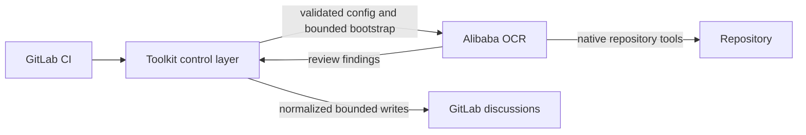
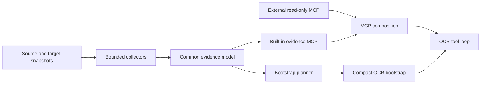

# Toolkit Strategy

This document is the durable source of truth for the product and architecture direction of Open Code Review Toolkit. It describes boundaries and intended outcomes, not execution order; see [the roadmap](../../ROADMAP.md) for sequencing and [the backlog](../codex/TASKS_BACKLOG.md) for implementation-ready work.

## Product purpose

Open Code Review Toolkit is a provider-neutral GitLab CI control and integration layer around Alibaba Open Code Review (OCR). Its purpose is to make OCR review predictable and safe in real pipelines: configuration is validated, project evidence is deterministic and bounded, and model-controlled results are normalized before GitLab publication.

The toolkit does not replace OCR. OCR owns diff review, file selection and bundling, codebase exploration, rule matching, its agent tool loop, finding generation, and initial finding positioning. The toolkit owns GitLab CI orchestration, OCR/provider/MCP configuration, deterministic project evidence, compact trusted bootstrap generation, project-policy overlays, OCR compatibility validation, safe result publication, and the discussion deduplication, suppression, ownership, and resolution lifecycle.



### Non-goals

The toolkit will not:

- modify or fork OCR, build a second review engine, agent loop, or per-tool model router;
- build a full repository scanner, symbol graph, call graph, or run full-repository `ocr scan` for merge-request review;
- add CodeGraph as a runtime dependency or project linters as a toolkit product capability;
- store versioned library documentation or prefetch issue and page contents into the bootstrap;
- add write tools for external systems or give OCR or an LLM direct GitLab write credentials.

Repository-maintenance analyzers such as Bandit remain valid quality controls for this codebase. They are not evidence providers or features offered to downstream repositories.

## Implemented architecture

The M1 implementation provides a schema-versioned Repository Evidence Engine with bounded immutable base/head reads, typed dependency/runtime/image/guidance records and deltas, redaction-before-storage, a compact bootstrap, and the built-in read-only `ocr_toolkit_evidence` MCP server. MCP configuration registers that server alongside reviewed external stdio or remote servers with explicit tool allowlists.

The legacy `context/*` Markdown renderer, its CLI/environment contract, and its parity-only bridge have been removed. The evidence store and compact bootstrap are private artifacts owned by `ocr-ci review`, not separately configured workflows.

The built-in evidence MCP is mandatory for ordinary evidence-backed reviews. External stdio and native HTTPS Streamable HTTP servers compose as independent optional entries; replacement mode may discard stale external entries but cannot remove or shadow the built-in server. The compact bootstrap is generated from the same validated capability composition that is written to OCR.

GitLab result normalization and posting are implemented behind provider-oriented modules. They bound and neutralize model-controlled text, use stable finding fingerprints, preserve human-owned discussions, and keep GitLab credentials outside OCR. Review health, published findings, failed-file coverage, and collapsed technical details are separate implemented concepts. The current recommended and tested OCR baseline belongs in the operational compatibility contract, not this durable strategy.

## Implemented Repository Evidence Engine

One Repository Evidence Engine analyzes source/head and target/base repository states, detects components affected by changed files, and records structured facts. Bootstrap and MCP project the same stored evidence; they must not grow separate collectors.



Every evidence record should preserve its kind and value together with source path, git ref, component scope, provenance, confidence, and staleness where meaningful. Collection is deterministic and network-independent. Storage has explicit bounds and stable ordering. Rendering never upgrades inferred or untrusted material into authoritative policy.

The engine separates four implemented responsibilities:

1. collectors parse repository material into structured evidence;
2. bounded storage normalizes and indexes that evidence;
3. bootstrap planning selects the smallest useful trusted overview;
4. renderers produce stable text or read-only MCP responses.

The evidence model is the main extension point. Ecosystem and framework plugins may contribute typed facts, but cannot run arbitrary commands, fetch the network, mutate the repository, or introduce a second review workflow.

## Implemented compact bootstrap and built-in evidence MCP

The OCR background is a compact bootstrap, normally around 1,500-2,500 characters and always below the toolkit/OCR hard limit. It contains authoritative constraints and trust instructions, base/head identity, detected ecosystems, material runtime or dependency changes, the validated composed MCP capability inventory, relevant accepted decisions, and short project-guidance hints. Bootstrap planning and OCR MCP configuration consume the same composition plan so the instructions cannot advertise unavailable tools or omit available allowlisted tools.

Complete manifests, dependency inventories, guidance documents, and external issue/page contents do not belong in the bootstrap. Detailed repository facts are available on demand through a built-in server registered under a reserved namespace such as `ocr_toolkit_evidence`, with tools prefixed `ocr_toolkit_`. Candidate tools expose review environment, changed components, dependency state and deltas, framework state, version evidence, and accepted decisions.

The server is read-only, repository-root constrained, bounded, deterministic, network-independent, and incapable of arbitrary command execution. Its summary, filtered/paginated list, and stable-ID get actions expose scoped evidence completeness: absence supports a negative conclusion only for an applicable complete scope. Reserved server and tool names plus global tool-collision checks prevent downstream configuration from shadowing built-in capabilities.

Compact bootstrap and built-in evidence MCP are one established user-visible unit. Detailed facts removed from the bootstrap remain available on demand through the built-in MCP.

## Partially implemented evidence domains

### Dependencies, runtimes, and components

Evidence already distinguishes declared constraints, locked versions, runtime declarations, repository-provided checksums, container/image versions, and unknown or runtime-dependent coverage. Source and target snapshots produce explicit deltas rather than an unlabelled merged inventory. Repository-derived installed metadata, workspace/platform variants, precedence conflicts, explicit mutable-tag versus immutable-digest semantics, and broader component-scoped completeness remain planned only where demonstrated use justifies them. Mutable runner inspection and arbitrary repository execution are non-goals.

Implemented collectors cover Python declarations, requirements, uv, Poetry, Pipenv locks, and standardized locks; JavaScript package metadata plus npm, Yarn, and pnpm locks; Go modules, toolchains, requirements, replacements, and checksums; Composer manifests, locks, and platform evidence; Ansible Galaxy requirements, role topology, inventories, and runtime-dependent coverage; and declarative container and GitLab CI images. Further expansion follows demonstrated repository use and requires synthetic fixtures, deterministic semantics, size bounds, and explicit behavior for malformed or missing files.

### Framework and template evidence

Framework support is package-owned static plugin extraction, not a code graph or framework-specific review engine. The established registry covers Jinja2 and Jinja/Ansible-style templates, Echo/Fiber with direct gRPC stack context, Symfony/Twig, and React/Next with TypeScript/Vite context. Plugins receive only immutable normalized dependency/tree evidence and exact core-owned source-status records from the collector, publish closed framework/template facts plus scoped completeness, and cannot read the repository independently, execute commands, fetch the network, mutate state, or create another MCP/review flow. Components follow the nearest declaration manifest (or conventional Ansible role), Go uses effective `go.mod` requirement/replacement semantics, and every read, parse, configuration, template, or provider limit degrades its exact scope instead of turning missing facts into proof.

OCR file selection remains a separate review-engine boundary. The public synthetic rules pack explicitly includes Jinja and Twig template paths that the recommended OCR does not allowlist by default, then supplies narrowly scoped merged rules. Framework identity, versions, component scope, configuration paths, and template deltas are stored once and served on demand by the existing built-in evidence MCP; rules neither duplicate those facts nor render templates.

The design borrows useful CodeGraph principles without adopting CodeGraph: deterministic extraction precedes rendering, work is component-scoped, facts retain provenance and staleness, and OCR retrieves surgical evidence on demand. Route, symbol, and call graphs remain out of scope.

### Planned versioned documentation

Version-specific library documentation belongs to a separate future documentation MCP. The evidence MCP establishes which package and version are present; the documentation MCP supplies matching documentation; OCR combines them. The toolkit does not mirror or store that documentation.

## Implemented external MCP and conditional references

YouTrack, Confluence, documentation, and other external sources can connect directly to OCR through narrowly scoped read-only MCP tools. The toolkit configures external stdio servers and native HTTPS Streamable HTTP servers with explicit tool allowlists and protected secret injection. HTTP-to-stdio remains a fallback or adapter pattern for local tools and provider-owned authentication, not the only remote path. Automatic candidate-reference detection in merge-request metadata is planned, not implemented; if introduced, it adds only normalized identifiers and usage instructions to the bootstrap and does not prefetch or duplicate external content.

All merge-request metadata and external MCP responses are untrusted evidence. A dedicated threat model must precede automatic reference detection and public provider-specific YouTrack or Confluence examples. Safe integration requires configured project-key patterns, allowed hosts or spaces, canonical parsing, bounded reference counts and link traversal, narrow tools instead of generic URL fetch, explicit prompt-injection guidance, and audit metadata for detected and retrieved references. External content cannot change review policy, suppress findings, authorize actions, modify tool permissions, or grant write access.

Public examples use only synthetic services. Generic stdio, native remote, static-header, and OAuth-owning proxy composition are documented today. Provider-specific YouTrack, Confluence, and documentation examples remain planned after the external-reference threat model; managed browser OAuth is conditional on a named provider need. External-system writes remain outside the generic toolkit scope.

## Project policy and guidance

### Planned accepted-decision metadata

`.opencodereview/accepted-decisions.md` evolves into tolerant semi-structured Markdown while preserving the existing heading-and-rationale format:

```markdown
## generated-client-timeout
The generated client retains its provider timeout so regeneration stays reproducible.

- Scope: `src/client/generated/**`
- Category: performance
- Review after: 2026-12-01
- Owner: client-platform
```

Metadata is optional and unknown fields do not invalidate the document. Only target-branch decisions may affect a review. Scoped summaries enter the bootstrap only when relevant; complete rationale may be exposed through evidence MCP. Decisions remain contextual evidence, not unconditional suppression or permission to ignore unrelated findings.

### Conditional AGENTS.md and CLAUDE.md simplification

The existing bounded, fail-closed guidance handling remains until upstream OCR documents and tests an automatic project-guidance contract. The intended simplification discovers applicable files, uses target-branch versions, excludes guidance modified by the current merge request, and passes paths plus short hints. Guidance is non-authoritative repository evidence; OCR may read the full target-branch files with its native repository tools when needed.

## Conditional review profiles and quality measurement

Qualified OCR releases expose explicit per-run provider/model overrides plus additive result identity. A lightweight explicit profile abstraction may select that one run-level model and existing OCR limits: `economy`, `standard`, or `strong`. Profiles do not dispatch individual files or tools to different models, and the compatibility manifest remains the source of capability availability.

Automatic routing is conditional on stable evidence, latency, token, and review-quality metrics. If activated, it is deterministic, conservative, observable, and never routes a merge request to a full-repository scan.

## OCR compatibility policy

Fast-moving upstream compatibility is a product capability, not an ad hoc version string update. One machine-readable manifest should define recommended and tested OCR releases and known capabilities. Version and capability inspection is centralized, additive output fields are parsed tolerantly, and required contract removal fails closed.

Contract tests cover the supported release set. Scheduled automation enumerates every unseen stable upstream release, verifies official checksums before bounded machine probes, and records reproducible evidence. Ordered candidates retain the current tested baseline while each classification uses its adjacent predecessor. A conservative same-minor maintenance classifier may prepare one cumulative compatibility patch only when the sequence is contiguous, every consumed contract remains stable, and no release notes contain a material signal. Minor/major, ambiguous, changed, failed, or mixed candidates always require human qualification. No lane writes directly to `main`: updating the manifest or recommended version remains a separate reviewed, checksum-pinned change with the normal protected PR and release gates.

## Historical and migration-only evidence

The [evidence migration matrix](evidence_migration_matrix.md) records the removal gates and parity evidence for the pre-0.4 `context/*` implementation. It is historical audit material, not a description of current runtime flow or an authority for future backlog scope.

## Architectural invariants

- Repository and external content are untrusted, bounded, redacted, and rendered safely.
- Evidence retains origin and trust level; content cannot promote itself into policy.
- Core evidence behavior is provider-neutral; forge-specific orchestration and publication stay behind adapters.
- OCR remains the only review and agent engine, and GitLab credentials remain toolkit-only.
- Bootstrap and MCP use one evidence model and one collector path.
- Built-in and external MCP tools are explicit, read-only, bounded, and auditable.
- Runtime dependencies remain zero unless a documented package or process boundary justifies one.
- Public documentation, fixtures, and examples remain synthetic.
