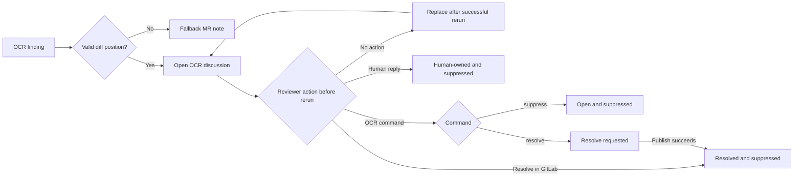

# GitLab review operations

This guide is for developers and CI operators who connect Open Code Review Toolkit to a GitLab merge-request pipeline and need to understand what happens after the first review. Installation remains in [gitlab.md](gitlab.md); the complete environment contract is in [configuration.md](configuration.md).

## What one review run publishes

The toolkit reads the previous OCR-owned notes and discussions before it writes anything. It fingerprints new findings, removes findings already owned or suppressed by reviewers, and publishes:

- inline GitLab discussions when a finding has a valid diff position;
- bounded fallback notes when GitLab cannot accept a position, for example after relevant lines moved outside the current diff;
- one summary note with counts, warnings, omitted findings, review effort, reviewed commit identity, and available token/tool usage.

`OCR_MAX_POST_COMMENTS` limits individually published findings. The default is 50 and the hard limit is 200. Omitted findings are counted in the summary rather than silently disappearing.

## Discussion lifecycle

If posting fails, the transition does not complete: the previous review and every human-owned, suppressed, or resolve-requested discussion keep their prior state. Matching findings remain suppressed on later runs.

An untouched open OCR discussion is bot-owned. A successful rerun replaces bot-owned notes with the current review instead of accumulating stale copies. Once a person replies, the discussion becomes human-owned: the toolkit preserves the complete conversation and suppresses a finding at the recorded inline position or with a compatible fingerprint.

A discussion resolved with GitLab's normal Resolve action is also preserved and suppresses a matching future finding. The toolkit never reopens a discussion.

## Reviewer commands

Reply inside an OCR-created discussion with exactly one command. Commands are case-insensitive, but the whole reply must contain only the command and optional surrounding whitespace. A command inside prose or a code block is ignored. If reviewers post several recognized commands, the newest one wins. Bot and GitLab system notes cannot issue commands.

| Command | Discussion after the command | Matching finding on future runs |
| --- | --- | --- |
| `/ocr suppress` | Remains open | Suppressed |
| `/ocr resolve` | Resolved after the next successful posting transaction | Suppressed |
| Ordinary human reply | Remains in its current state and becomes human-owned | Matching position or fingerprint suppressed |
| GitLab Resolve action | Resolved | Suppressed |

The command is applied when the next pipeline reads the discussion. `/ocr resolve` waits until all notes created for the current review have published successfully before resolving the old discussion. A failed run therefore does not close it prematurely.

`/ocr keep` and `/ocr skip` were removed in 0.2.0 and are not aliases. An existing reply containing an old command still counts as an ordinary human reply: its conversation is preserved and matching future findings remain suppressed, but it does not request automatic resolution.

## Will OCR report the same bug again?

Every OCR note contains an invisible toolkit marker and a stable finding fingerprint. The current fingerprint combines the repository path, normalized finding text, and the existing-code fragment when OCR supplies one. This lets suppression survive an ordinary line shift. Backward-compatible fingerprints keep review decisions made by earlier toolkit versions usable.

Suppression checks both the recorded inline position and compatible fingerprints. A new finding anchored to the same recorded path and line is suppressed even if its text changes; elsewhere, the fingerprint prevents ordinary line movement from bypassing the decision. Suppression is intentionally not a permanent rule for an entire file: a materially different explanation, code fragment, path, or duplicate occurrence at another location can become a new finding and receive a new discussion. When identical findings occur more than once, occurrence-aware fingerprints prevent suppressing every occurrence after a reviewer acts on only one of them.

## Posting modes and blocking behavior

`OCR_POST_MODE=draft` is the safe default. The toolkit creates this run's notes as GitLab draft notes, publishes only those drafts one by one, and removes replaceable notes from the previous successful review only after every publish succeeds. If creation fails, drafts from the current attempt are removed and the previous review remains visible. Draft mode avoids exposing an incomplete review during the creation phase, but GitLab does not provide an atomic bulk-publish transaction.

`OCR_POST_MODE=direct` writes notes immediately. It exists as an emergency compatibility override. The toolkit still performs best-effort rollback, but an ambiguous network timeout can mean GitLab accepted a write that the runner cannot confirm. Prefer `draft` for normal CI.

`OCR_STRICT_POSTING=false` is the advisory default: an OCR or posting error remains visible in the job log and, when possible, in an MR note, but the posting helper exits successfully. Set `OCR_STRICT_POSTING=true` when OCR review is a required merge gate so OCR failures, an unavailable GitLab API, an unsafe previous-state snapshot, an invalid OCR result, or failed publication make the job fail.

## GitLab identity and permissions

Use a dedicated project access token with `api` scope and at least the Developer role. Store it in `GITLAB_API_TOKEN`. The toolkit needs to read merge-request notes, discussions, diff refs, and the current token identity; create and delete its own notes or drafts; publish drafts; and resolve discussions requested by reviewers.

The toolkit calls `GET /user` before posting and refuses to write if it cannot identify the token owner. It treats a note as bot-owned only when both the invisible OCR marker and the actual GitLab author ID match. Text that merely imitates an OCR marker is not enough to claim or delete another user's note.

## Reruns, failures, and fallback notes

Before a rerun, the toolkit takes a bounded snapshot of OCR-owned notes, discussions, and drafts. If it cannot collect that state reliably, it refuses to publish a replacement so resolved, suppressed, and human-owned decisions are not lost. Reads and writes have bounded response sizes and timeouts; writes are retried only when retrying is safe.

The previous review is deleted only after the new review has been created and, in draft mode, published. A definite write failure rolls back notes known to belong to the current attempt. An ambiguous draft-publish failure does not delete possibly published notes because the runner cannot prove which writes GitLab accepted.

When GitLab rejects an inline position as invalid, the toolkit moves that finding into one or more bounded fallback notes. Ambiguous write failures do not use fallback, because doing so could duplicate a discussion that GitLab already accepted.

Source and base merge-request SHAs define the reviewed range. A merge-result commit is not treated as the source branch head. The summary records the reviewed SHA and warns when the current MR head has moved, so reviewers can distinguish a current review from a stale pipeline result.
