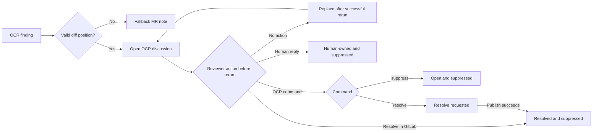

# GitLab review operations

This guide is for developers and CI operators who connect Open Code Review Toolkit to a GitLab merge-request pipeline and need to understand what happens after the first review. Installation and the [production bot recipes](gitlab.md#production-bot-configuration) remain in `gitlab.md`; the complete environment contract is in [configuration.md](configuration.md), and enriched acquisition is in [bounded review context](review-context.md).

## What one review run publishes

The toolkit reads the previous OCR-owned notes and discussions before it writes anything. It fingerprints new findings, removes findings already owned or suppressed by reviewers, and publishes:

- inline GitLab discussions when a finding has a valid diff position;
- bounded fallback notes when GitLab cannot accept a position, for example after relevant lines moved outside the current diff;
- one `## Open Code Review` note whose single bold outcome line combines review health with the published, omitted, or reviewer-suppressed finding state; incomplete coverage and warnings remain explicit below it, with operational posting, commit, token/tool, and used-MCP metadata under a collapsed technical-details disclosure.

Category and severity belong to each individual finding, not to the review
outcome line. They use private-safe text labels by default. Operators may opt in
to static Shields.io images with `OCR_POST_BADGES=shields`; only closed,
normalized OCR enums enter the fixed-host URL and the same label remains as alt
text. If only one field is present, the image path uses an explicit `category`
or `severity` label rather than an ambiguous value-only badge. Unknown metadata never becomes a URL. Because rendering can contact an
external image service directly or through a GitLab proxy, keep text mode for
installations that must avoid that disclosure or dependency.

An actionable GitLab suggestion is stricter than an ordinary finding. The
toolkit reads the exact reviewed head blob and requires `existing_code` to
match the stated inclusive line range before it renders a replacement fence.
For this comparison CRLF and CR are normalized to LF and one optional terminal
newline is ignored. The replacement must describe one contiguous edit: a
fabricated ellipsis bridge, unified-diff-prefixed text, unsafe Markdown fence,
quick action, invalid range, or unavailable source suppresses only the
actionable fence. The explanatory finding remains visible with a bounded reason
that does not reproduce repository content. Exact no-op suggestions are also
suppressed.

`OCR_MAX_POST_COMMENTS` limits individually published findings. The default is 50 and the hard limit is 200. Omitted findings are counted in the summary rather than silently disappearing.

`OCR_MAX_TOKENS_BUDGET` can set an aggregate input-plus-output token ceiling for the OCR diff review. The default `0` is unlimited. A positive ceiling is approximate rather than a hard billing cutoff because already-running work may complete; when it stops further dispatch, completed findings remain publishable and unreviewed files stay explicit as budget-attributed failed coverage. Such a run is partial and cannot automatically approve.

This aggregate budget is separate from both OCR's prompt/context `max_tokens` ceiling and the provider request's completion/output cap. The toolkit does not add an environment alias for OCR's prompt/context control. `OCR_LLM_MAX_COMPLETION_TOKENS` defaults to unset and, when set, overlays only the protocol-specific output field. The inherited OpenAI value was 58,888 in OCR 1.9.10 and is 16,384 in OCR 1.10.0 and 1.10.1. A gateway may reserve cost against that requested maximum before generation even when the eventual response would be short. The `/models` capability value does not reveal an account spending limit or reservation policy, so the toolkit never selects the cap from it automatically. Set an explicit cap when a deployment must not change with the qualified OCR version.

`OCR_REVIEW_EFFORT=medium` is the toolkit default for the qualified OCR release and permits two review rounds; `low` permits one and `high` permits three. This is a review-depth choice, not one of the three token controls. OCR first groups related changed files and may make group-filter requests; additional rounds can add requests, latency, and cost, but may stop early when they add no finding. The published GitLab example separately passes `OCR_MAX_TOOLS=0`, delegating the effective per-file tool-call limit to the installed OCR template instead of carrying a release-specific minimum. A positive value can raise that limit, but operators should check the release's behavioral qualification because CLI help, normalization text, and effective template value can differ. Exhausting the effective limit, an aggregate budget stop, or incomplete manifest coverage remains explicit and approval-ineligible; increasing either effort or tools is never a way to hide partial coverage.

The outcome wording distinguishes skipped, complete, complete-with-warnings, incomplete, token-budget, and failed reviews while preserving the finding state in that same line. A complete clean review is visibly positive; a complete review with findings or only reviewer-suppressed findings is neutral; warning, partial, budget, and failed states never look clean. Findings withheld by the posting limit remain counted even when the limit allows no individual finding note. Recommended focus areas ranks only its copy of already-published findings by the closed severity, category, safe repository location, and stable-identity order before its existing display cap; inline and fallback discussion order, suppression, counts, security focus, and approval policy remain unchanged. OCR 1.8.5 and later manifest failures provide the canonical failed-file receipt; legacy warnings are a bounded fallback, and `summary.files_reviewed` is never treated as proof of successful coverage. Technical details label the aggregate as all OCR tool calls and retain the existing inline format while listing every admitted non-zero count for the closed native/context/evidence review set. An empty admitted list produces no tool-call line. The counts describe review activity, not per-tool token consumption: one read or search can return a different amount of context from another. Dynamic external tool names remain private; toolkit-verified MCP-server calls stay in their separate aggregate, and built-in evidence `summary`/`list`/`get` counts appear only after exact reconciliation. Zero-valued token counters and configured-but-unused MCP servers are omitted. Token usage renders only validated input/output/cached/reasoning/total/derived-other buckets; malformed or contradictory counters are unavailable and unknown provider keys are not published. Status and aggregate semantic-category emoji are enabled by default and can be disabled together with `OCR_POST_EMOJI=false`; finding labels remain text unless their separate badge mode is enabled.

## Automatic approval lifecycle

`OCR_AUTO_APPROVE=true` is the default. Approval is a separate transaction only
after every current review note publishes. A review is eligible only with exact closed receipt v5, a supported complete manifest, no warnings, failures, waivers, token-budget stop, or omitted findings, no configured direct external MCP, no degraded metadata, no DLP-rejected selected source, no required context degradation, no admitted remediation context, and at most three findings. Receipt v1-v4 is rejected by posting and approval. Receipt v5 binds reviewed source/policy SHA, merge-request author ID, context mode/state, bounded configured MCP inventory and positive use, per-source completeness/degradation, admitted-mutable state, fixed context-tool use, mandatory evidence state, publication DLP, and cleanup. The receipt's admitted-mutable state is the comment-only signal for an admitted remediation thread; DLP-clean metadata, generic discussions, and adapter records do not set it. `private-sanitized` remains eligible only when its canonical publication/approval projection is byte-equivalent; `publication-filtered` is partial and ineligible. Complete `metadata` context, complete non-remediation enrichment, and the built-in evidence/context MCP do not independently block approval. Every finding must have
severity exactly `low` and category exactly `style`, `documentation`, or
`maintainability`. A complete zero-finding review is eligible. Four findings,
malformed metadata, or any other severity/category are not eligible.

Before writing, the toolkit repeatedly reads the MR and its bounded diff-version list. It requires an open MR, a current head equal to the receipt-bound 40-character SHA, the same positive MR author ID recorded at review time, `detailed_merge_status` outside `checking` and `approvals_syncing`, and a non-null `patch_id_sha`. If the authenticated toolkit user is that author, self-approval is skipped without a write. Otherwise it passes the exact reviewed SHA to GitLab's approve API and confirms the authenticated user, exact SHA, and unchanged non-bot author in post-write approval readback. A moved head or changed author before the write is a normal `skipped` result and is never retried against the new identity; a post-write mismatch fails closed and leaves GitLab's existing approval state untouched.

Approve and summary-update writes are not retried after timeout, connection
loss, 5xx, or another ambiguous response. GitLab remains
authoritative for eligible approvers, required groups, Code Owners,
protected-branch rules, and password or SAML reauthentication. A rejected or
failed approval never rolls back the already published advisory review.

The summary records exactly one bounded state: `approved`, `not eligible`,
`disabled`, `skipped`, or `failed`. With advisory `OCR_STRICT_POSTING=false`, an
approval-management failure leaves the published review successful but visibly
failed; with `OCR_STRICT_POSTING=true`, it also returns a nonzero exit code.

The transaction is deliberately add-only because GitLab's unapprove endpoint
cannot bind removal to an immutable reviewed SHA at mutation time. The toolkit
therefore never removes an existing approval, even when the authenticated bot
user approved earlier. Ineligible, partial, skipped, legacy, and disabled runs
do not make an approval write. Configure GitLab's project-owned reset or
invalidation policy when approvals must be withdrawn after new commits. Human
discussion replies remain ownership boundaries for notes but do not
independently block approval.

## Discussion lifecycle

If posting fails, the transition does not complete: the previous review and every human-owned, suppressed, or resolve-requested discussion keep their prior state. Matching findings remain suppressed on later runs.

An untouched open OCR discussion is bot-owned. A successful rerun replaces bot-owned notes with the current review instead of accumulating stale copies. Once a person replies, the discussion becomes human-owned: the toolkit preserves the complete conversation and suppresses a finding at the recorded inline position or with a compatible fingerprint.

A discussion resolved with GitLab's normal Resolve action is also preserved and suppresses a matching future finding. The toolkit never reopens a discussion.

## Reviewer commands

Reply inside an OCR-created discussion with exactly one command. Commands are case-insensitive, but the whole reply must contain only the command and optional surrounding whitespace. A command inside prose or a code block is ignored. If reviewers post several recognized commands, the newest one wins. Bot and GitLab system notes cannot issue commands.

| Command | Discussion after the command | Matching finding on future runs |
| --- | --- | --- |
| `/ocr suppress` or `@<live-bot-username> suppress` | Remains open | Suppressed |
| `/ocr resolve` or `@<live-bot-username> resolve` | Resolved after the next successful posting transaction | Suppressed |
| Ordinary human reply | Remains in its current state and becomes human-owned | Matching position or fingerprint suppressed |
| GitLab Resolve action | Resolved | Suppressed |

The mention form uses the username returned by authenticated `GET /user`; no configured username is trusted. A GitLab username may contain punctuation, so a bot named `mr.bot` accepts the exact reply `@mr.bot resolve`. A typo such as `supress`, a different mention, or `@mr.bot retest` is not a lifecycle command.

The command is applied when the next pipeline reads the discussion. `/ocr resolve` and its mention equivalent wait until all notes created for the current review have published successfully before resolving the old discussion. A failed run therefore does not close it prematurely. The toolkit does not receive comment events, so use GitLab's retry UI/API for a no-commit rerun; a comment-triggered rerun requires a separately deployed Note Hook receiver.

`/ocr keep` and `/ocr skip` were removed in 0.2.0 and are not aliases. An existing reply containing an old command still counts as an ordinary human reply: its conversation is preserved and matching future findings remain suppressed, but it does not request automatic resolution.

## Will OCR report the same bug again?

Every OCR note contains an invisible toolkit marker and a stable finding fingerprint. The current fingerprint combines the repository path, normalized finding text, and the existing-code fragment when OCR supplies one. This lets suppression survive an ordinary line shift. Backward-compatible fingerprints keep review decisions made by earlier toolkit versions usable.

Suppression checks both the recorded inline position and compatible fingerprints. A new finding anchored to the same recorded path and line is suppressed even if its text changes; elsewhere, the fingerprint prevents ordinary line movement from bypassing the decision. Suppression is intentionally not a permanent rule for an entire file: a materially different explanation, code fragment, path, or duplicate occurrence at another location can become a new finding and receive a new discussion. When identical findings occur more than once, occurrence-aware fingerprints prevent suppressing every occurrence after a reviewer acts on only one of them.

## Posting modes and blocking behavior

`OCR_POST_MODE=draft` is the safe default. Every position-bearing inline create receives a separate cryptographically random write marker before `POST /draft_notes`. A valid success records the returned positive draft ID. If the one create is ambiguous, the toolkit performs one complete bounded author-bound `/draft_notes` read and recovers only exactly one matching marker/ID; zero, multiple, foreign, malformed, unavailable, or incomplete results cause no retry and no fallback. Current-run draft IDs are published exactly once, and replaceable notes from the previous successful review are removed only after every publish succeeds. Draft mode avoids exposing an incomplete review during creation, but GitLab does not provide atomic bulk publication.

`OCR_POST_MODE=direct` is an emergency compatibility override. Position-bearing `POST /discussions` uses the same independent marker and one complete bounded reconciliation read after ambiguity. Recovery requires exactly one toolkit-owned note with the expected author, positive note ID, and bounded discussion ID. Explicit current-run discussion identities participate in rollback; marker-only global rescans do not. Direct mode remains non-atomic, so prefer `draft` for normal CI.

`OCR_STRICT_POSTING=false` is the advisory default: an OCR, posting, or approval-management error remains visible in the job log and, when possible, in an MR note, but the posting helper exits successfully. Set `OCR_STRICT_POSTING=true` when OCR review is a required merge gate so OCR failures, an unavailable GitLab API, an unsafe previous-state snapshot, an invalid OCR result, failed publication, or failed approval management make the job fail.

## OCR diagnostics

Run OCR through `ocr-ci review --result PATH --stderr PATH -- ...`. This wrapper does not post to GitLab: it creates private artifacts, acquires enriched context when selected, asks the exact resolved and preflight-qualified OCR executable to preview the production refs/rules/selection/background without an LLM, then runs the model review only if OCR accepts that background. OCR owns the current recommendation and rejection thresholds; the toolkit has no threshold setting. A recognized soft diagnostic is reduced to a toolkit-authored `ocr.toolkit-advisory/v1` enum and two positive character counts. It is attached after publication DLP, rendered only with an exact receipt v5 in Technical details, and does not change warnings, coverage, DLP counts, telemetry, or automatic approval. A recognized hard character/file-size rejection stops before the model and lets `ocr-ci post` publish only a static numeric failure summary; the OCR path and raw diagnostic remain private. Unknown preview failures use the generic fail-closed diagnostic path. The ordinary review still validates the same background, the wrapper validates the complete output, and context/session/configuration data is removed. On an unclassified ordinary failure it prints only a bounded redacted stderr excerpt to the runner log; a classified provider failure keeps that excerpt private. Pass the paths and captured exit code to `ocr-ci post` afterward. Set `OCR_POST_ERROR_DETAILS=1` only when the generic path's safe excerpt should also appear in the merge-request failure note. Cleanup uncertainty blocks result publication. DLP atomically converts unsafe publication output into a safe `completed_with_errors` subset, but sanitizes unsafe private-only result fields without discarding an otherwise valid manifest or finding set. Safe findings are posted, unsafe finding content/warnings and unsafe optional fields are omitted, previous OCR comments remain, and matching prior findings are consumed one-for-one rather than duplicated. Receipt v5 and the `ocr.publication-dlp-signal/v2` marker distinguish `private-sanitized`, where the canonical published and approval-relevant projection is unchanged, from partial approval-ineligible `publication-filtered`. The same count-only JSON is logged as `OCR toolkit telemetry event` for optional CI collection/alerting. It is not an OTLP/network exporter and contains no rejected value or location. Never interpret a filtered subset as a full review.

OCR 1.10.1 may add group labels, file membership, and round diagnostics to its private result. Safe values remain private; DLP removes or replaces unsafe values before atomic retention. These fields are deliberately absent from the canonical finding/posting projection and receipt v5, so private-only sanitization does not block an otherwise eligible auto-approval. If any group or round field appears inside receipt v5, the receipt is invalid and approval fails closed. Caller `--output`/`-o` is rejected before preview: only `ocr-ci review --result` owns the result descriptor and posting handoff.

When OCR exits nonzero with a valid bounded `ocr.llm-retry-report/v1`, the toolkit reads only its closed error class, failure phase, terminal outcome, and HTTP status. It maps those facts to `authentication`, `authorization`, `rate-or-spending-limit`, `overloaded`, `timeout`, `network`, `endpoint-or-model-not-found`, `request-rejected`, `provider-unavailable`, `invalid-response`, `cancelled`, `mixed`, or `unknown`, then writes a completely toolkit-authored note. A runtime `404` remains `endpoint-or-model-not-found` because safely distinguishing the endpoint from the model would require trusting the raw response body.

For `429`, the note says that ordinary throttling, an account or API-key spending limit, or cost reservation from the requested output cap are all possible. Retry later and check provider limits. If short probes pass while a full review fails before generation, try an explicit `OCR_LLM_MAX_COMPLETION_TOKENS`, for example `4096`; this is a diagnostic workaround, not a claim that the cap was the cause.

Raw provider/model identities, response bodies, error codes and messages, request IDs, paths, warnings, and stderr remain in owner-only private artifacts for a classified provider failure. `OCR_POST_ERROR_DETAILS=1` cannot add them to that note. Normal findings from the failed result are ignored, the previous successful review is preserved, and automatic approval is not attempted. Missing, oversized, malformed, or internally contradictory retry reports keep the existing generic failure path instead of guessing a classification.

For a local diagnosis, add `--preserve-private-artifacts` before the `--` separator. The command retains the isolated OCR home plus repository-local private evidence/context artifacts, prints only their paths, and deliberately leaves the raw OCR result without receipt v5; do not pass that result to `ocr-ci post`. It writes `.review-context/private-dlp-decisions.json` with value-free bounded JSON paths, closed reason and detector subtype, size units, and SHA-256 for up to 1,000 rejected keys/values, plus explicit truncation and omitted-decision counts. Use matching digests to identify one repeated technical value and inspect the retained raw result locally before deciding whether a conservative PII match is a false positive; the sidecar itself is not proof that content is safe. These owner-only files can contain source/provider context, prompts, model responses, tool arguments/results, and generated runtime configuration. Inspect them locally, keep them out of commits and shared artifacts, then delete them after extracting the needed evidence. Ordinary runs do not retain this attribution. The authoritative GitLab merge-request profile rejects the flag before OCR execution and performs normal cleanup; an arbitrary `CI=true` value neither grants nor blocks the local mode.

Two pre-execution outcomes have narrower static reporting. When the merge request introduces the configured repository-owned OCR rules path and that exact path is absent from both immutable policy-side baselines, `review` verifies only that the source object is a bounded regular blob, writes a closed private status, and stops before OCR. When installed OCR rejects the generated background during preview, the status instead carries the closed character/file-size reason plus actual, limit, and unit. `post` hostile-validates either v2 status against the current source and diff-base identities and renders only toolkit-authored text. A successful retry replaces only an earlier toolkit-owned setup-pending note; background rejection and generic failures never replace previous review findings or summaries. Neither outcome includes the rules/background path or raw stderr and neither trusts repository/provider display text. Malformed, stale, unsafe, unknown, or identity-mismatched state falls back to the generic failure note. `OCR_POST_EMOJI=false` removes the heading emoji; `OCR_POST_ERROR_DETAILS` does not add detail to recognized static outcomes.

## GitLab identity and permissions

Use a dedicated project access token with `api` scope and at least the Developer role. Store it in `GITLAB_API_TOKEN`. The toolkit needs to read merge-request notes, discussions, diff refs, approval state, and the current token identity; create and delete its own notes or drafts; publish drafts; resolve discussions requested by reviewers; and, unless opted out, approve as that dedicated identity. GitLab must separately consider the identity eligible under the project's approval rules.

The toolkit calls `GET /user` before posting and refuses to write if it cannot identify the token owner. It treats a note as bot-owned only when both the invisible OCR marker and the actual GitLab author ID match, and uses the same validated live identity's username for mention commands. Text that merely imitates an OCR marker is not enough to claim or delete another user's note.

## Reruns, failures, and fallback notes

Before a rerun, the toolkit takes a complete bounded snapshot of OCR-owned notes, discussions, and drafts. If it cannot collect that state reliably, it refuses to publish a replacement so resolved, suppressed, and human-owned decisions are not lost. Reads and writes have bounded response sizes and timeouts; non-idempotent creates are never blindly retried.

For position-bearing inline creates, outcomes are closed: `posted`, `invalid_position`, `definite_failure`, or `ambiguous_create`. Only `invalid_position` may enter bounded fallback. An ambiguous create receives one complete endpoint-specific marker/author readback; unresolved ambiguity causes no retry and no fallback. Regular notes/drafts, updates, deletes, resolve, draft publication, and approval do not gain reconciliation or retry behavior.

The previous review is deleted only after the new review has been created and, in draft mode, published. Explicit provider-returned or reconciled current-run identities drive rollback, guarded by the complete pre-run ID baseline; the toolkit never infers rollback ownership from a marker-only global rescan. An ambiguous draft-publish failure still does not delete possibly published notes because the runner cannot prove which drafts became visible.

Source and base merge-request SHAs define the reviewed range. A merge-result commit is not treated as the source branch head. The summary records the reviewed SHA and warns when the current MR head has moved, so reviewers can distinguish a current review from a stale pipeline result.
