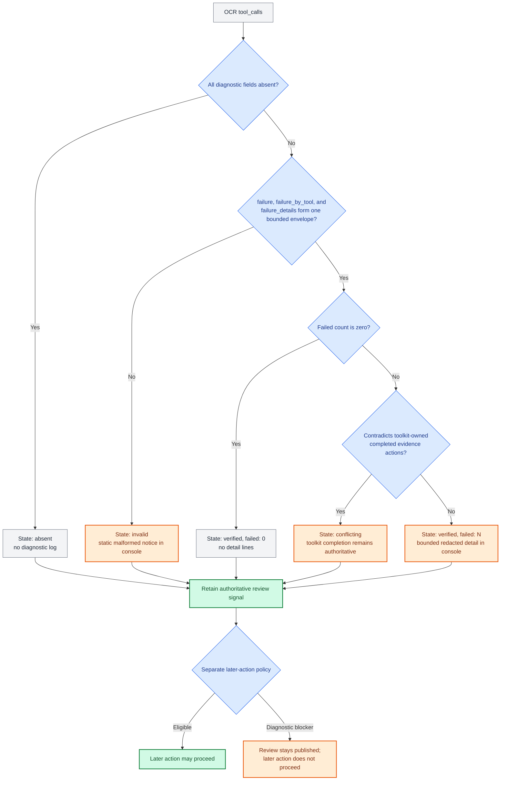
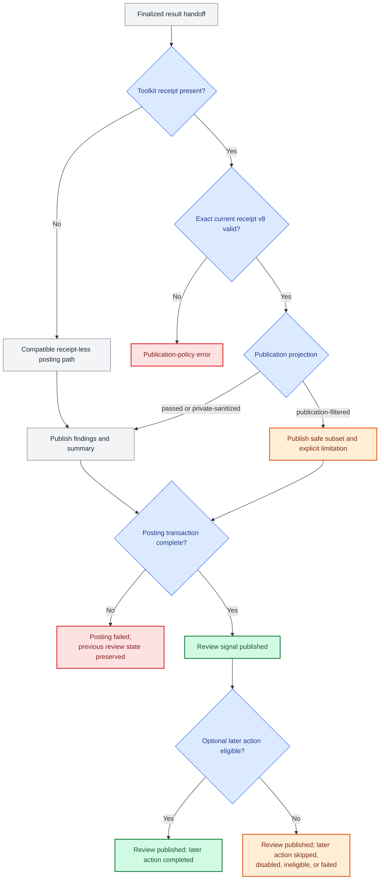

# Review decision flow

This document is the canonical visual map of the toolkit's end-to-end review decisions. It
connects configuration and immutable identity, OCR execution, result and action-receipt
validation, additive diagnostics, publication DLP, GitLab posting, and optional later actions.
The shorter diagrams in [the toolkit strategy](engineering/toolkit_strategy.md) remain
architecture overviews; this document owns the detailed operational branches.

The diagrams describe toolkit decisions, not OCR finding quality or GitLab merge policy. The
executable authorities remain the runtime validators and their contract tests. If this map and
an executable contract disagree, the change is incomplete: update the implementation, tests,
and every affected public contract together before release.

## Color legend

| Color | Meaning |
| --- | --- |
| Green | Successful terminal state: the intended review signal was retained or published. |
| Orange | Warning terminal state: useful signal survived, but completeness or a later action is limited. |
| Red | Error terminal state: the current stage stopped and must not claim successful publication. |
| Gray | Auxiliary or neutral state: input, processing step, or an intentional non-publication path. |
| Blue | Decision or validation boundary. |

The same palette is repeated in every diagram so a terminal state never changes meaning between
views.

## End-to-end control flow

```mermaid
flowchart TD
    start[CI or local review request] --> input{Configuration, immutable refs,<br/>target state, and paths valid?}
    input -- No --> preflight_error[Review blocked before OCR]
    input -- Yes --> acquire[Collect bounded immutable evidence<br/>and optional authorized context]
    acquire --> acquire_ok{Evidence, context, and MCP<br/>composition valid?}
    acquire_ok -- No --> preflight_error
    acquire_ok -- Yes --> preview[Run exact OCR preview with<br/>toolkit-owned child environment]
    preview --> preview_ok{Preview accepted?}
    preview_ok -- No --> preview_error[OCR not started; bounded failure path]
    preview_ok -- Yes --> review[Run OCR against exact from/to refs]
    review --> exit{OCR exit code}
    exit -- Non-zero --> runtime_error[No normal result publication;<br/>closed failure note may be posted]
    exit -- Zero --> finalize[Enter result finalization]
    finalize --> core{Result, manifest, identity, cleanup,<br/>and toolkit action receipt valid?}
    core -- No --> integrity_error[Delete unsafe handoff;<br/>normal publication blocked]
    core -- Yes --> diag[Classify additive failed-tool diagnostics]
    diag --> dlp[Apply publication sinks and private-field DLP]
    dlp --> dlp_state{DLP state}
    dlp_state -- passed --> publishable[Complete publishable projection]
    dlp_state -- private-sanitized --> publishable
    dlp_state -- publication-filtered --> partial[Safe partial projection;<br/>original coverage remains explicit]
    publishable --> mode{Execution profile}
    partial --> mode
    mode -- Local diagnostic retention --> local[Owner-only artifacts retained;<br/>no provider receipt or posting authority]
    mode -- Local ordinary --> local_result[Validated receipt-less local result]
    mode -- GitLab MR --> receipt[Attach exact receipt v8]
    receipt --> post{Posting input valid at readback?}
    post -- No --> posting_error[Publication-policy error;<br/>findings transaction not started]
    post -- Yes --> transaction[Publish current findings and summary atomically]
    transaction --> transaction_ok{All required writes succeed?}
    transaction_ok -- No --> posting_error
    transaction_ok -- Yes --> published{Projection complete?}
    published -- Yes --> success[Review signal published]
    published -- Safe partial --> warning[Safe review subset published;<br/>not a complete public review]

    classDef success fill:#d1fae5,stroke:#15803d,color:#14532d,stroke-width:2px;
    classDef warning fill:#ffedd5,stroke:#ea580c,color:#7c2d12,stroke-width:2px;
    classDef error fill:#fee2e2,stroke:#dc2626,color:#7f1d1d,stroke-width:2px;
    classDef auxiliary fill:#f3f4f6,stroke:#6b7280,color:#1f2937;
    classDef decision fill:#dbeafe,stroke:#2563eb,color:#1e3a8a;

    class success,local_result success;
    class warning warning;
    class local auxiliary;
    class preflight_error,preview_error,runtime_error,integrity_error,posting_error error;
    class start,acquire,preview,review,finalize,diag,dlp,publishable,partial,receipt,transaction auxiliary;
    class input,acquire_ok,preview_ok,exit,core,dlp_state,mode,post,transaction_ok,published decision;
```

The core integrity boundary deliberately precedes additive diagnostics. A malformed result,
contradictory manifest, stale identity, failed cleanup, or missing/mismatched toolkit action
receipt blocks finalization. By contrast, OCR's additive failed-tool envelope is diagnostic: it
cannot replace an otherwise valid manifest, findings, summary, or posting transaction.

## Additive failed-tool diagnostic states

Valid detail records are bounded, credential-redacted, and control-safe before they reach the
local stderr or CI job log. Dynamic detail text, paths, and per-tool failure maps never enter the
finalized result, receipt, merge-request comments, publication-DLP telemetry, or later-action
inputs. Receipt v8 stores only `absent|verified|invalid|conflicting` and a bounded aggregate
`failed` integer for `verified`; the toolkit action receipt v3 remains authoritative for evidence
attempts and completions.

This separation applies in every execution profile. It is not a local-mode exception and it is
not an automatic-approval feature: publication owns review-signal delivery, while any later action
evaluates the already-published result independently.

## Posting and later-action states

The current GitLab later action is an optional receipt-bound approval write. It is only one
consumer of the finalized state. Unprotected targets, incomplete coverage, publication filtering,
non-zero or uncertain tool diagnostics, context blockers, external MCP, identity movement, and
other documented gates can make that action unavailable without turning a successfully published
review into a failure. GitLab approval rules, Code Owners, protected-branch policy, and mergeability
remain external merge-policy authorities.

## Maintenance contract

Update this document in the same change whenever any of these boundaries changes:

- review preflight, immutable identity, target-protection, OCR preview, or child environment;
- result/manifest parsing, action receipt, receipt schema, cleanup, or DLP projection;
- diagnostic parsing or any console, result, receipt, summary, comment, or telemetry sink;
- posting transaction ordering, partial-publication behavior, or a later-action gate.

Before merging such a change, compare every diagram branch with the relevant runtime owner and
hostile regression, render or parse the Mermaid blocks, and reconcile
[configuration](configuration.md), [operations](operations.md),
[security](security.md), [review context](review-context.md), the
[test evidence matrix](engineering/test_evidence_matrix.md), and the architecture summary in
[toolkit strategy](engineering/toolkit_strategy.md). Do not add a second detailed flow elsewhere;
link to this document instead.
